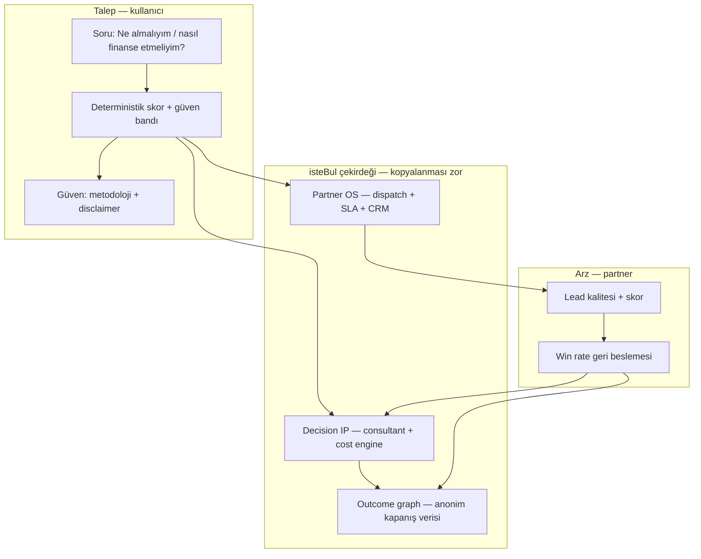

# isteBul — Competitive Moat Stratejisi

**P23 ops config:** [`data/ops/category-dominance-strategy.json`](../data/ops/category-dominance-strategy.json) · [`CATEGORY_DOMINANCE_STRATEGY.md`](./CATEGORY_DOMINANCE_STRATEGY.md)

**Amaç:** Kopyalanması zor iş modeli — envanter veya trafik yarışı değil; **karar kalitesi + güven + kapalı döngü gelir** üzerine kurulu savunulabilir platform.

**Tez:** Rakipler **listeleme / rezervasyon / tek ürün satışı** optimize eder. isteBul **yüksek düşünme maliyetli kararları** (araç, konut, kredi, sigorta, tatil) tek akışta birleştirir: fit + TCO + finansman + risk + partner yönlendirme — **sayılar deterministik, anlatım LLM, para partner ve Pro’dan**.

---

## 1. Kopyalanması zor iş modeli (hedef mimari)



| Katman | Ne satıyoruz? | Rakip tipik model | Neden zor kopyalanır |
|--------|---------------|-------------------|----------------------|
| **Karar** | Öneri + gerekçe + TCO | İlan / OTA / oran tablosu | Skor + confidence ayrımı, testli motor |
| **Güven** | “Tahmin / canlı” şeffaflığı | Karanlık AI veya statik form | Anti-hallucination sözleşmesi (LLM fiyatı değiştiremez) |
| **Monetizasyon** | Pro + nitelikli lead + dispatch | İlan ücreti / komisyon tek kanal | Operasyonel entegrasyon + CRM kapanış döngüsü |
| **Genişleme** | 8 dikey, tek registry | Tek kategori silosu | Cross-vertical karar grafiği (uzun vade) |

**Tek cümle:** *“Neutral decision infrastructure with closed-loop partner economics”* — Türkiye’de classifieds veya bankanın doğal ürünü değil; her ikisinin **arasındaki güvenilir katman**.

---

## 2. Rakip kategorileri ve pozisyon

### 2.1 Sahibinden / Arabam (ilan marketplaces)

| Boyut | Onlar | isteBul |
|-------|-------|---------|
| Ana metrik | İlan sayısı, MAU | Qualified lead + karar tamamlama |
| Kullanıcı işi | Bul → ara → pazarlık | Fit et → TCO gör → finansman → tek tık lead |
| Gelir | İlan / öne çıkarma / bayi paketi | Skorlu lead + Pro |
| Zayıf noktaları | Karar yükü kullanıcıda; TCO/finans dağınık | Envanter derinliği |

**Strateji:** İlan sitesi **olmayız**. “Sahibinden’de arama, isteBul’da karar” — embed/affiliate ve SEO hub ile trafik alıp **karar katmanında tutmak**. Rakip AI eklerse: listeleyici AI ≠ skor + confidence + partner dispatch.

### 2.2 Hepsiemlak (konut marketplace)

| Boyut | Onlar | isteBul |
|-------|-------|---------|
| Odak | Portföy, emlak ofisi | Konut **maliyet + kredi yükü** (ev dikeyi) |
| Veri | İlan meta | Truth profile + simülasyon (canlıya geçiş) |

**Strateji:** Konut’ta **“aylık toplam sahip olma maliyeti”** ve kredi senaryosu ile farklılaş; CRM lead’i konut dikeyine taşıyınca aynı partner OS devreye girer (`PLATFORM_EXPANSION_ROADMAP.md`).

### 2.3 Booking (OTA / tatil)

| Boyut | Onlar | isteBul |
|-------|-------|---------|
| Odak | Anlık rezervasyon | Tatil **bütçe + finansman + destinasyon fit** |
| Kilit | Envanter + tedarikçi | Karar asistanı + Pro |

**Strateji:** Rezervasyon motoru inşa etmeyiz; **“nereye, ne bütçeyle, nasıl ödeyeceğim”** sorusuna cevap — Booking’in uzun kuyruk SEO’suna karşı **karar içeriği + lifecycle** (`docs/LIFECYCLE_CRM.md`).

### 2.4 Fintech comparison (banka karşılaştırma, KOBİ kredi siteleri)

| Boyut | Onlar | isteBul |
|-------|-------|---------|
| Odak | Faiz / ürün tablosu | **Varlık bağlamında** finansman (araç fiyatı → vade → ödeme) |
| Tarafsızlık | Sponsor banka | Neutral ranking + `finance_offers` truth |

**Strateji:** “Oran karşılaştır” değil **“bu araç + bu peşinat için hangi yük”** — Auto funnel ile birleşik. Banka kopyalarsa: onlar tek ürün satar; biz **çok dikey + lead dispatch**.

### 2.5 Genel marketplace platformları (Trendyol, Amazon TR, …)

| Boyut | Onlar | isteBul |
|-------|-------|---------|
| Consideration | Düşük (hızlı al) | Yüksek (araç, ev, kredi) |
| AI | Öneri / arama | Danışman + compliance |

**Strateji:** Elektronik dikeyi **düşük öncelik**; yüksek sepet + düzenlemeli kategorilere odak. Marketplace’lerin “AI shopping” hamlesi **karar motoru + CRM kapanışı** olmadan isteBul tezini tekrarlamaz.

---

## 3. Sekiz moat boyutu (derinlemesine)

### 3.1 Defensibility (genel savunulabilirlik)

| Seviye | Bugün | 12 ay hedef | Kanıt |
|--------|-------|-------------|--------|
| Yazılım IP | **Orta-yüksek** | Yüksek | `decision-consultant.js`, unit testler, `AI_DECISION_ENGINE.md` |
| Veri | **Düşük-orta** | Orta-yüksek | Catalog + finance offers; canlı feed + outcome DB |
| Ağ etkisi | **Düşük** | Orta | Partner SLA + win rate |
| Marka / güven | **Orta** | Orta-yüksek | Şeffaflık, KVKK, metodoloji UI |

**Bileşik savunma:** Tek katman kopyalanabilir (ör. sadece chat UI). **Skor + dispatch + CRM + outcome** birlikte kopyalanması 12–18 ay operasyonel borç gerektirir.

### 3.2 Differentiation (farklılaşma)

| Rakip varsayılanı | isteBul farkı |
|-------------------|---------------|
| “Daha çok ilan” | “Daha doğru öneri + neden” |
| “En düşük faiz” | “Toplam sahip olma + finansman yükü” |
| “AI cevap verir” | “AI anlatır; sayıları motor verir” |
| “Form gönder” | “Skorlu lead + otomatik partner route” |

**Mesaj çerçevesi (pazarlama):** *Karar platformu* — marketplace veya banka değil.

### 3.3 Switching costs (geçiş maliyeti)

| Kullanıcı | Maliyet mekanizması | Ürün aksiyonu |
|-----------|---------------------|---------------|
| **Pro abone** | Geçmiş kararlar, sınırsız karşılaştırma, PDF | `decision_history`, Stripe |
| **Lead vermiş kullanıcı** | Partner süreci, takip | CRM + lifecycle e-posta |
| **Partner** | Webhook, SLA, skor kalibrasyonu | `partner-dispatch`, callback |
| **Kurumsal** | API + özel endpoint (gelecek) | Partner pack |

**Hedef metrik:** 90 günde 2+ karar oturumu → Pro veya ikinci dikey kullanım.

### 3.4 Data moat (veri hendeği)

| Veri türü | Kaynak | Moat gücü | Yol haritası |
|-----------|--------|-----------|--------------|
| Vehicle cost truth | `vehicle_cost_profiles` | Orta | OEM / bayi feed |
| Finance offers | `finance_offers` | Orta | Banka API / günlük sync |
| Outcome / win rate | `auto_leads.actual_revenue` | **Yüksek (birikimli)** | Zorunlu CRM disiplini |
| Anonim benchmark | Aggregated | Yüksek | “Bu segmentte 14 günde kapanan modeller” |
| Market simulation | `market-data.js` | Düşük (şeffaf) | `liveProvidersEnabled: true` |

**Kural:** Simülasyon modunda **dürüstlük = güven moat**; sahte “canlı” iddiası moat’ı yok eder.

**Data flywheel:**

```
Lead → dispatch → partner_status → actual_revenue
  → scoring weight tuning → better lead quality → partner retention
```

### 3.5 AI moat

| Katman | Moat? | Açıklama |
|--------|-------|----------|
| Generic LLM | **Hayır** | Commodity |
| Prompt + UI | **Düşük** | Hızlı kopya |
| **Deterministik skor + confidence** | **Evet** | Testli, denetlenebilir |
| **LLM fiyat/skora dokunamaz** | **Evet** | Regülasyon + güven |
| Vertical birleşik consultant | **Evet (uzun vade)** | Registry + tek motor |

**AI stratejisi:** LLM’i **narration layer**’da tut; rekabeti **“hangi araç, hangi gerekçe, hangi güven bandı”** üzerinde kazan. Rakip “ChatGPT ile araba öner” derse: TCO + finansman + partner + CRM yok.

**Koruma:** Trade secret scoring weights; algoritma dokümantasyonu data room’da; isteğe bağlı patent (confidence ≠ score ayrımı).

### 3.6 Partner moat

| Bileşen | Durum | Güçlendirme |
|---------|-------|-------------|
| Dispatch + retry + circuit breaker | Canlı | Bölge bazlı exclusivity |
| Lead scoring (server) | `auto-intake` | Outcome-weighted skor |
| CRM + revenue alanları | Admin | Partner başına win rate raporu |
| Lifecycle partner follow-up | Otomasyon | `partner_follow_up` flow |

**Ağ etkisi:** Daha iyi lead → partner daha hızlı callback → daha yüksek conversion → daha iyi skor kalibrasyonu → rakibin aynı trafigi alması daha az değerli.

**Sözleşme moat:** 6–12 ay bölge/dikey exclusivity; minimum SLA; lead geri bildirim zorunluluğu (yoksa data moat durur).

### 3.7 UX moat

| Öğe | Rakip tipik | isteBul |
|-----|-------------|---------|
| Karar yorgunluğu | 5–10 sekme | Tek wizard + sonuç kartı |
| Güven | Opak | Metodoloji strip, breakdown, confidence badge |
| Mobile | İlan tarama | Auto mobile-first, modal lead |
| Karşılaştırma | Manuel | `comparison-store` + Pro |

UX tek başına moat değil; **UX + deterministik çıktı + CRM** birlikte alışkanlık yaratır.

### 3.8 Trust moat

| Güven sütunu | Uygulama |
|--------------|----------|
| Sayısal dürüstlük | Simulation etiketleri, `dataHealth` |
| KVKK / onay | Lead form privacy, partner paylaşım |
| Anti-spam | Turnstile, rate limit, junk phone |
| Operasyonel şeffaflık | Admin audit logs |
| İçerik | Rehber SEO + metodoloji (E-E-A-T) |

**Türkiye’de yüksek consideraton:** Güven, fiyat moat’ından önce gelir — banka ve classified’a kıyasla **tarafsız danışman** konumlandırması.

---

## 4. Moat yığını — öncelik sırası

```text
[Trust + Decision IP]  ← bugün savunulabilir çekirdek
        ↓
[Partner OS + CRM outcomes]  ← 6–12 ay, operasyon disiplini
        ↓
[Data moat + cross-vertical graph]  ← 12–24 ay
        ↓
[Brand: "karar önce isteBul"]  ← bileşik
```

| Öncelik | Yatırım | Moat etkisi |
|---------|---------|-------------|
| P0 | CRM’de actual_revenue doldurma | Data + partner |
| P0 | Scoring ← win rate geri besleme | Partner + AI |
| P1 | 1 canlı veri sağlayıcı (fiyat veya faiz) | Data + trust |
| P1 | Konut lead → aynı CRM | Differentiation vs Hepsiemlak |
| P2 | Category registry + tek scoring | AI + UX + expansion |
| P2 | Partner exclusivity (2 bölge) | Partner |
| P3 | Anonim benchmark ürünü | Data + switching |

---

## 5. Rakibin kopyalama senaryoları ve karşı hamle

| Senaryo | Muhtemel hamle | isteBul karşılığı |
|---------|----------------|-------------------|
| Sahibinden “AI asistan” | Chat + ilan önerisi | Metodoloji + TCO + dispatch; “ilan değil karar” PR |
| Banka “araç danışmanı” | Markalı tek ürün | Neutral multi-bank + araç bağlamı |
| Fintech lead gen | Sadece form | Skor + partner route + lifecycle |
| Yeni startup UI | Güzel wizard | Partner ağı + outcome verisi (zamanla) |
| Global LLM | Genel tavsiye | TR regülasyon + yerel TCO + Pro |

**En zayıf anımız:** Sadece SEO + simülasyon, partner outcomes boş → **data moat yok**, sadece UX.

**En güçlü anımız:** Partner’lar isteBul lead’ini tercih ediyor + kullanıcı Pro’da geçmiş kararını taşıyor.

---

## 6. Ölçülebilir moat KPI’ları

| KPI | Moat boyutu | Hedef (örnek) |
|-----|-------------|---------------|
| Partner dispatch success rate | Partner | >85% |
| Lead → contacted <24h | Partner + trust | >70% |
| actual_revenue / estimated | Data | >0.6 correlation |
| Pro 90-day retention | Switching | >40% |
| 2+ vertical sessions / user | Differentiation | >15% cohort |
| Organic → qualified lead CVR | Trust + UX | Kanal bazlı iyileşme |
| Median time-to-decision | UX | <8 dk Auto |

Export: `npm run metrics:investor` · `npm run metrics:growth` · `npm run metrics:lifecycle`

---

## 7. Bilinçli olarak moat sayılmayanlar

- Ham trafik / ilan envanteri
- Generic ChatGPT entegrasyonu
- Sadece SEO rehber sayfaları
- Tahmini komisyon without partner contract
- UI tema / animasyon

*(Due diligence’da dürüst anlat — `docs/investor/MOAT_AND_DEFENSIBILITY.md` ile uyumlu.)*

---

## 8. 24 aylık moat inşaat planı (özet)

| Çeyrek | Kilometre taşı | Moat |
|--------|----------------|------|
| Q1 | CRM outcome disiplini + 3 anchor partner | Partner + data |
| Q2 | Canlı finance veya fiyat feed + retention lifecycle | Data + trust |
| Q3 | Konut lead + unified `decision_leads` | Differentiation |
| Q4 | Anonim benchmark v1 (“segment insights”) | Data + switching |
| Y2 H1 | Registry + tek scoring tüm dikeyler | AI + UX |
| Y2 H2 | Bölge exclusivity + API partner tier | Partner |

---

## 9. İlgili dokümanlar

| Konu | Dosya |
|------|--------|
| Kısa moat özeti (EN) | `docs/investor/MOAT_AND_DEFENSIBILITY.md` |
| AI motor | `docs/AI_DECISION_ENGINE.md` |
| 8 dikey | `docs/PLATFORM_EXPANSION_ROADMAP.md` |
| Büyüme flywheel | `docs/GROWTH_ENGINE.md` |
| Lifecycle otomasyon | `docs/LIFECYCLE_CRM.md` |
| Riskler | `docs/investor/RISK_REGISTER.md` |

---

**Özet:** isteBul’un kopyalanması zor modeli = **tarafsız karar altyapısı** + **kapalı döngü partner ekonomisi** + **biriken outcome verisi**. Classifieds ve fintech parçaları kopyalayabilir; **üçlünün operasyonel bütünü** — özellikle CRM disiplini ve partner ağı — moat’ı oluşturur.
