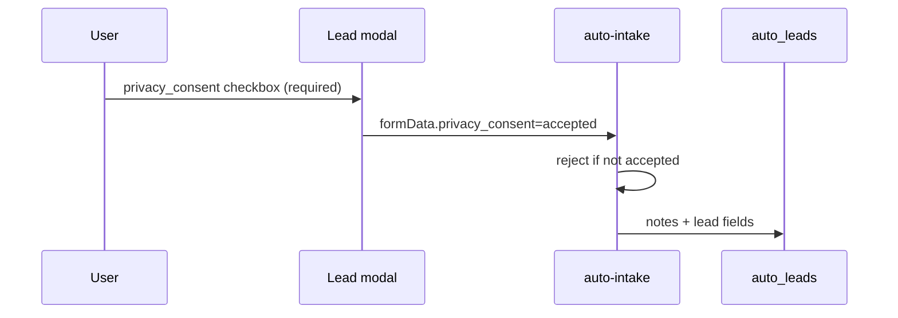

# Compliance Readiness Audit — KVKK / GDPR

**Tarih:** 2026-06-01 (güncellendi)  
**Kapsam:** isteBul web uygulaması (TR odaklı, global expansion hazırlığı)  
**Amaç:** Hukuki riskleri azaltmak — mevcut kontroller, boşluklar, öncelikli aksiyonlar.

**Uyarı:** Bu belge **hukuki tavsiye değildir**. Nihai metinler ve veri işleme envanteri için **KVKK/GDPR danışmanı** zorunludur.

**Runbook:** `docs/COMPLIANCE_RUNBOOK.md` · **Saklama:** `data/compliance/retention-schedule.json`

---

## 1. Executive summary

| Alan | Hazırlık | Skor (1–5) |
|------|----------|------------|
| KVKK aydınlatma | İyi — `/kvkk.html` + anchor’lar, veri sorumlusu, retention tablosu | 4 |
| GDPR (AB kullanıcı) | Düşük — EN metin / SCC yok | 1 |
| Cookie consent | İyi — ana SPA + kurumsal statik banner, kategori tablosu | 4 |
| Privacy policy | Kısmi | 2 |
| Terms | Kısmi — disclaimer var, B2C eksik | 2 |
| Lead consent | Orta — UI checkbox + server doğrulama (bu PR) | 3 |
| Marketing consent | Zayıf → iyileştirme (checkbox + local only) | 2 |
| Data retention | Dokümante (schedule); otomasyon yok | 2 |
| User deletion | Profil → KVKK silme talebi (mailto); otomasyon yok | 3 |
| Subprocessors | `SUBPROCESSORS.md` | 3 |

**Genel verdict:** **Pilot / launch TR için temel farkındalık var**; ölçek ve AB trafiği öncesi **hukuk review + DPA + tam aydınlatma + silme SLA** şart.

---

## 2. Mevzuat haritası

| Mevzuat | Uygulanabilirlik | Platform durumu |
|---------|------------------|-----------------|
| **6698 KVKK** | TR kullanıcı, TR veri sorumlusu varsayımı | `kvkk.html` — eksik |
| **GDPR** | AB/EEA ziyaretçi veya müşteri | Resmi uyum yok |
| **ePrivacy / çerez** | TR + AB pratikleri | Banner var; çerez politikası eklendi |
| **Tüketici / mesafeli** | Pro abonelik, lead hizmeti | `kullanim-sartlari.html` ince |
| **Finansal tavsiye** | Simülasyon etiketleri | `AI_DECISION_ENGINE.md` + UI disclaimers |

---

## 3. KVKK

### 3.1 Mevcut

| Kontrol | Konum |
|---------|--------|
| Aydınlatma sayfası | `/kvkk.html` |
| Lead form metni | `auto-app.js` — KVKK + gizlilik + partner paylaşımı |
| Onay kaydı | `auto_leads.notes` — “KVKK/partner paylaşım onayı: alındı” |
| Server doğrulama | `auto-intake` — `privacy_consent === accepted` (zorunlu) |
| İletişim kanalı | `/iletisim.html` |

### 3.2 Eksikler (tipik KVKK checklist)

| Unsur | Durum |
|-------|--------|
| Veri sorumlusu unvan/adres | ❌ Metinde yok |
| VERBİS kaydı | ❓ Hukuk doğrulamalı |
| İşleme amaçları (detaylı) | ⚠️ Özet |
| Hukuki sebep (5/2 m.) | ❌ |
| Alıcı grupları / yurt dışı aktarım | ⚠️ `SUBPROCESSORS.md` teknik; aydınlatmada yok |
| Saklama süreleri | ⚠️ `retention-schedule.json` |
| İlgili kişi başvuru yöntemi | ⚠️ İletişim e-postası; KVKK başlığı yok |
| Başvuru yanıt süresi | ❌ |
| İtiraz / şikayet (Kurul) | ❌ |

### 3.3 Aksiyonlar

| ID | Öncelik | Aksiyon |
|----|---------|---------|
| C-K1 | P0 | Avukat ile `kvkk.html` tam aydınlatma metni |
| C-K2 | P0 | Veri sorumlusu kimliği tüm legal sayfalarda |
| C-K3 | P1 | VERBİS / envanter (VERBİS beyan) |
| C-K4 | P1 | Partner DPA + lead aktarım sözleşmesi |

---

## 4. GDPR

### 4.1 Mevcut

- Cookie banner (kabul / red) — analytics ve Plausible consent-gated.
- `operational-telemetry.js` — PII scrubbing in ops events.
- RLS — client direct PII table access denied.

### 4.2 Eksikler

| GDPR gereksinim | Durum |
|-----------------|--------|
| Lawful basis documentation | ❌ |
| Privacy notice Art. 13/14 (EN) | ❌ |
| DPA with processors (Stripe, Supabase, …) | ❌ Resmi |
| DPIA (yüksek risk işleme) | ❓ Lead + profiling |
| SCC / transfer mechanism | ❌ US vendors (Groq, Sentry) |
| DPO appointment | ❓ Ölçeğe bağlı |
| Data subject rights SLA | ❌ Runbook draft |

### 4.3 Aksiyonlar

| ID | Öncelik | Aksiyon |
|----|---------|---------|
| C-G1 | P1 | AB trafik < threshold ise geo notice; scale’de EN privacy |
| C-G2 | P1 | Stripe/Supabase/Cloudflare DPA imzala |
| C-G3 | P2 | Transfer Impact Assessment (Groq, Sentry) |

---

## 5. Cookie consent

### 5.1 Mevcut implementasyon

| Öğe | Detay |
|-----|--------|
| Banner | `#cookie-consent` — Kabul / Reddet |
| Storage | `istebul_cookie_consent` = `accepted` \| `declined` |
| Analytics SDK | `analytics.hasConsent()` — first-party events blocked if declined |
| Plausible | Script yalnızca `accepted` sonrası `loadAnalytics()` |
| Sentry | `monitoring.init(true)` yalnızca consent sonrası |
| Ops telemetry | Hata event’leri consent’ten bağımsız (PII scrub) — dokümante |

### 5.2 Gap’ler

| Gap | Risk |
|-----|------|
| Çerez kategorileri (zorunlu / analitik) ayrımı yok | Orta |
| Tercih merkezi / geri çekme UI | Orta — sadece localStorage clear |
| `plausible-init.js` static load? | Kontrol — dynamic load tercih |
| Pre-consent attribution capture | `captureAttribution` consent sonrası init’te |

### 5.3 İyileştirme

- **`/cerez-politikasi.html`** — çerez türleri tablosu (bu PR).
- Banner’a politika linki.

---

## 6. Privacy policy (`gizlilik.html`)

### Mevcut

- Genel ilkeler: amaç sınırlaması, pazarlama için satış yok, güvenlik.

### Eksik

- Subprocessor listesi linki
- Retention özeti
- International transfers
- Children
- Contact / DPO
- Automated decision-making (skorlama) açıklaması

**Aksiyon C-P1:** Avukat ile gizlilik politikasını KVKK ile hizala.

---

## 7. Terms (`kullanim-sartlari.html`)

### Mevcut

- Karar desteği ≠ yatırım/finans tavsiyesi
- Partner koşulları değişkenliği
- Kötüye kullanım

### Eksik

- Sorumluluk sınırlaması (limitation of liability)
- Uyuşmazlık / yetkili mahkeme
- Pro abonelik iptal / iade (Stripe Terms referansı)
- Fikri mülkiyet

**Risk register:** R3, R12 — `RISK_REGISTER.md`

---

## 8. Lead consent

### 8.1 Flow

### 8.2 Kapsam onayı metni

Checkbox metni: KVKK, Gizlilik, **uygun partnerlerle paylaşım** — partner lead dispatch ile uyumlu.

### 8.3 Gap’ler

| Gap | Mitigation |
|-----|------------|
| Partner listesi dinamik değil | Aydınlatmada “kategori” (bayi, finans, sigorta) |
| Telefon/e-posta ayrı opt-in yok | Tek kombine onay — hukuk onayı |
| Consent timestamp ayrı kolon yok | `notes` + `created_at`; migration `consent_at` önerilir |

---

## 9. Marketing consent

### 9.1 Kanallar

| Kanal | Consent durumu |
|-------|----------------|
| **Newsletter footer** | Checkbox eklendi (bu PR); veri yalnızca `localStorage` — **backend yok** |
| **Lifecycle email** | `lifecycle-enroll` — transactional/nurture; ayrı opt-in gerekir |
| **growth / analytics** | Cookie consent |

### 9.2 Kritik bulgu

Newsletter önceden **gerçek e-posta listesi oluşturmuyordu** (sadece localStorage + başarı mesajı). Bu **yanıltıcı UX** ve KVKK açısından risk. 

**Düzeltme:** Açık pazarlama onayı + “henüz e-posta altyapısı bağlanmadı” veya Resend list entegrasyonu (P1).

### 9.3 Lifecycle / unsubscribe

- `lifecycle-enroll` `action: unsubscribe` — `unsubscribed_at` set.
- Public link: e-posta şablonlarında `buildUtmLink` — **List-Unsubscribe header** P1.

---

## 10. Data retention

Schedule: `data/compliance/retention-schedule.json`

| Veri | Önerilen süre | Otomasyon |
|------|---------------|-----------|
| `auto_leads` (aktif pipeline) | 24 ay | ❌ Cron yok |
| `auto_leads` (kapatılmış/spam) | 12 ay anonimleştir | ❌ |
| `analytics_events` | 24 ay | ❌ |
| `operational_events` | 90 gün | ❌ |
| `auth.users` | Hesap silinene kadar | Manuel |
| `subscriptions` | Yasal + Stripe | Stripe master |
| Newsletter local | Kullanıcı cihazı | N/A |

**Aksiyon C-R1:** Supabase cron / edge `data-retention-job` (P1 engineering).

---

## 11. User deletion workflows

### 11.1 Mevcut

| Yol | Durum |
|-----|--------|
| Self-service “hesabı sil” | ❌ Yok |
| Auth `signOut` | Oturum kapanır; veri kalır |
| Admin kullanıcı silme | Admin panel — kısıtlı |
| `lifecycle` unsubscribe | Email only |

### 11.2 Önerilen workflow (manuel → yarı otomatik)

1. Kullanıcı `kvkk@` / iletişim e-postasına başvuru (kimlik doğrulama).
2. Ops: `COMPLIANCE_RUNBOOK.md` — silme checklist.
3. Supabase Auth admin delete user.
4. `profiles`, `subscriptions` (Stripe cancel), `auto_leads` anonymize phone/email.
5. `analytics_events` — anonimleştir veya sil (session_id).
6. `lifecycle_contacts.unsubscribed_at` + enrollments cancel.
7. Yanıt: 30 gün içinde (KVKK pratik hedef).

### 11.3 Aksiyonlar

| ID | Öncelik | Aksiyon |
|----|---------|---------|
| C-D1 | P0 | Runbook + iletişim sayfasında “KVKK başvurusu” |
| C-D2 | P1 | Account sayfasında “Verilerimi yönet” linki |
| C-D3 | P2 | Edge `user-data-request` (export + delete) |

---

## 12. Teknik kontroller özeti

| Kontrol | PASS/WARN/FAIL |
|---------|----------------|
| RLS on PII tables | PASS |
| Lead consent UI | PASS |
| Lead consent server | PASS (post-fix) |
| Cookie before analytics | PASS |
| Marketing opt-in | WARN (checkbox; no ESP) |
| Legal page completeness | FAIL (counsel) |
| GDPR EN | FAIL |
| Automated retention | FAIL |
| Self-delete | FAIL |

---

## 13. Öncelik backlog

| ID | P0 | P1 | P2 |
|----|----|----|-----|
| Legal full KVKK + privacy + terms | ✓ | | |
| Lead `consent_at` column + IP hash | | ✓ | |
| Retention cron job | | ✓ | |
| Newsletter → Resend with double opt-in | | ✓ | |
| Cookie preference center | | | ✓ |
| GDPR EN + SCC | | ✓ | |
| User data export API | | | ✓ |

---

## 14. Referanslar

| Dosya | Konu |
|-------|------|
| `docs/COMPLIANCE_RUNBOOK.md` | Başvuru / silme adımları |
| `data/compliance/retention-schedule.json` | Saklama |
| `docs/investor/SUBPROCESSORS.md` | İşleyenler |
| `kvkk.html` · `gizlilik.html` · `kullanim-sartlari.html` · `cerez-politikasi.html` |
| `js/app.js` | Cookie consent |
| `js/core/analytics.js` | Consent gate |
