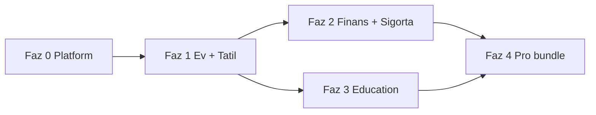

# P8 — Expansion Strategy Roadmap (Ev · Tatil · Finans · Sigorta · Education)

**Rol:** Expansion strategist  
**Tarih:** 2026-05-24  
**Veri kaynağı:** `data/platform/expansion-roadmap.json`  
**Platform bağlamı:** `docs/PLATFORM_EXPANSION_ROADMAP.md` (8 dikey); bu belge **5 öncelikli kategori** için yatırımcı + ürün + GTM planıdır.

---

## 1. Stratejik tez

isteBul bugün **Auto** ile kanıtlanmış bir karar → lead → partner döngüsüne sahip. P8 hedefi, aynı güven katmanını (skor, maliyet şeffaflığı, danışman özeti) şu beş dikeye ölçeklemek:

| Kategori | Kod ID | Tür | Olgunluk |
|----------|--------|-----|----------|
| **Ev** | `ev` → slug `konut` | Varlık alımı | ~70% |
| **Tatil** | `tatil` | Paket / hizmet | ~75% |
| **Finans** | `finans` (embed) | Finansal ürün | ~55% |
| **Sigorta** | `sigorta` (parçalı) | Finansal ürün | ~35% |
| **Education** | `education` | Paket / hizmet | ~0% |

**North star:** Bir kullanıcı ev alırken kredi ve DASK’ı, tatil planlarken seyahat sigortasını ve taksit seçeneklerini **aynı platformda** tek skor mantığıyla görsün; partner geliri `decision_leads` üzerinden ölçülsün.

---

## 2. Mevcut kod gerçekliği (anchor)

```
Karar Merkezi (/)
  ├── arac     → /auto/     [production golden path]
  ├── ev       → wizard + maliyet + konut kredisi sim. [local history only]
  ├── tatil    → wizard + 42 destinasyon [local history only]
  ├── finans   → createFinanceComparisons() embed [arac/ev/tatil]
  ├── sigorta  → maliyet satırları + CRM insurance + affiliate stub
  └── education → (yok)
```

**Kritik borç (Faz 0 — tüm P8 için bloklayıcı):**

1. Merkezi `category-registry.js` yok.  
2. CRM yalnızca `auto_leads`; ev/tatil Supabase’e gitmiyor.  
3. Skorlama ikiye bölünmüş: `decision-consultant.js` (Auto) vs `calculateAssistantScores()` (asistan).  
4. `liveProvidersEnabled: false` — tüm dikeyler simülasyon.

---

## 3. Faz planı (P8)



### Faz 0 — Platform foundation (zorunlu)

| # | Çıktı | Başarı |
|---|--------|--------|
| 0.1 | `js/platform/category-registry.js` — 5 vertical tanımı | Tek PR ile yeni soru seti |
| 0.2 | `decision_leads` + `decision-intake` edge | Tatil lead admin’de görünür |
| 0.3 | CRM `vertical_id` filtresi | Unified pipeline |
| 0.4 | Analytics `vertical_id` | Funnel dikey kırılımı |
| 0.5 | Market data Supabase publish | Admin senkron |

**Yatırımcı hikayesi:** `growth-story.json` phase_2 (“Vertical expansion”) bu fazın tamamlanmasıyla “live” sayılır.

---

### Faz 1 — Ev & Tatil production parity

**Ev (`ev` → `/konut/`)**

- Mevcut: tam wizard, `estimateHomeOwnershipCost`, DASK satırları, demo ilanlar.  
- Yapılacak: `property_catalog`, emlak partner intake, SEO hub, slug ayrışması (`konut` SEO, `ev` kod).  
- Monetizasyon: mortgage broker CPL (yüksek), Pro bölge raporu.  
- Cross-sell: finans (konut kredisi), sigorta (DASK + konut).

**Tatil (`/tatil/`)**

- Mevcut: en olgun asistan profili, destinasyon kataloğu.  
- Yapılacak: dedicated route, `travel_packages` DB, OTA lead, sezon kampanyaları.  
- Monetizasyon: tur operatörü / OTA CPL.  
- Cross-sell: tatil kredisi sim., seyahat sigortası.

**Çıkış metrikleri:** `lead_capture_rate` ev & tatil ≥ Auto benchmark’ın %40’ı (ilk 90 gün hedefi).

---

### Faz 2 — Finans & Sigorta (cross-vertical merkez)

**Finans**

- Mevcut: `createFinanceComparisons`, `finance_offers`, `PARTNER_OFFERS.finance`.  
- Yapılacak: `/finans/` bağımsız wizard; taşıt / konut / ihtiyaç / eğitim kredisi profilleri; BDDK uyarı şablonu.  
- GTM: Auto + konut + tatil kararlarından **otomatik cross-sell kartı** (zaten embed — standalone’a terfi).

**Sigorta**

- Mevcut: maliyet kalemleri, `insurance` CRM stage, `insurance_partner`.  
- Yapılacak: branş wizard (kasko, DASK, konut, seyahat); `insurance_products`; prim band truth.  
- GTM: “Risk kapatma” anı — karar sonuç ekranında tek tık partner.

**Regülasyon kapısı:** Finans ve sigorta **live CPL** öncesi hukuk onayı (BDDK / SEDDK bilgilendirme metinleri).

---

### Faz 3 — Education (greenfield)

| Adım | Açıklama |
|------|----------|
| Veri | Pilot `program_catalog` (~50 program: üniversite, bootcamp, dil) |
| Ürün | 3 adım wizard (hedef, süre, bütçe) + `estimateEducationCost` |
| Partner | 3 kurum LOI (lead fiyat bandı) |
| SEO | `/egitim/` hub + 2 landing |
| Pro | Program eşleştirme raporu (₺499 bandı) |

**Bağımlılık:** Faz 0 registry; Faz 2 finans (eğitim kredisi cross-sell).

---

### Faz 4 — Pro & intelligence

- `pro_verticals`: `['arac','ev','tatil','finans','sigorta','education']`  
- Karar geçmişinde çoklu dikey portföy görünümü  
- AI narration: `verticalId` başına prompt şablonu (`ai-proxy.js`)  
- Executive KPI: `cross_sell_attach`, `verticals_live = 5`

---

## 4. GTM ve gelir önceliklendirme

| Sıra | Kategori | B2B potansiyel | Hazırlık | İlk partner tipi |
|------|----------|----------------|----------|------------------|
| 1 | Ev | Çok yüksek | %70 | Emlak + mortgage |
| 2 | Tatil | Orta-yüksek | %75 | OTA / tur |
| 3 | Finans | Çok yüksek | %55 | Banka / broker |
| 4 | Sigorta | Orta-yüksek | %35 | Poliçe affiliate |
| 5 | Education | Orta | %0 | Kurum / bootcamp |

**Flywheel (P8):** SEO dikey hub → wizard tamamlama → `decision_leads` → partner dispatch → `actual_revenue` → skor kalibrasyonu.

---

## 5. Cross-sell matrisi

| Birincil karar | Önerilen ikincil |
|----------------|------------------|
| Ev | Konut kredisi, DASK, emlak sigortası |
| Tatil | Tatil kredisi, seyahat sigortası |
| Auto (referans) | Taşıt kredisi, kasko |
| Education | Eğitim kredisi, burs bilgisi |
| Finans (standalone) | İlgili varlık dikeyine geri yönlendirme |

Teknik: Faz 2’de `lead_cross_sells` tablosu (`PLATFORM_EXPANSION_ROADMAP.md` Faz C).

---

## 6. KPI çerçevesi

| KPI | P8 kullanımı |
|-----|----------------|
| `decisions_completed` | Dikey bazlı ürün-market fit |
| `lead_capture_rate` | Ev/tatil parity ölçütü |
| `partner_accept_rate` | Finans/sigorta CPL kalitesi |
| `cross_sell_attach` | Platform (tek karar, çok lead) |
| `pro_conversion` | Dikey bazlı Pro upsell |
| `confidence_tier_distribution` | Güven katmanı tutarlılığı |

Export: `npm run metrics:executive` + gelecekte `expansion-snapshot` script.

---

## 7. Riskler

| Risk | Azaltma |
|------|---------|
| Registry olmadan education launch | Faz 0 zorunlu |
| Ev/tatil geliri CRM dışı | `decision_leads` Faz 0 |
| Finans/sigorta regülasyon | Legal gate + örnek oran etiketi |
| Education veri boşluğu | Pilot katalog + 3 LOI |
| Simülasyon güveni | Truth layer + kaynak şeridi (Auto pattern) |

---

## 8. Onboarding checklist (yeni dikey — education örneği)

- [ ] `verticals` + `category-registry.js` entry `education`  
- [ ] Wizard + `getEducationDecisionOptions()`  
- [ ] Scorer weight profili + `estimateEducationCost`  
- [ ] `decision-intake` routing  
- [ ] CRM stage labels  
- [ ] SEO hub + 2 landing  
- [ ] Analytics events  
- [ ] Pro free limit satırı  
- [ ] KVKK / eğitim sözleşmesi disclaimer  
- [ ] Unit test: scorer + cost smoke  

---

## 9. İlgili dosyalar

| Dosya | Amaç |
|-------|------|
| `data/platform/expansion-roadmap.json` | Makine-okur faz + kategori |
| `docs/P8_CATEGORY_EXPANSION.md` | Yönetici özeti (1 sayfa) |
| `docs/PLATFORM_EXPANSION_ROADMAP.md` | 8 dikey mimari |
| `data/investor/growth-story.json` | phase_2 hizalama |
| `scripts/p8-category-expansion-audit.cjs` | CI doğrulama |

---

*P8 expansion strategist deliverable — deploy via `main` push.*
