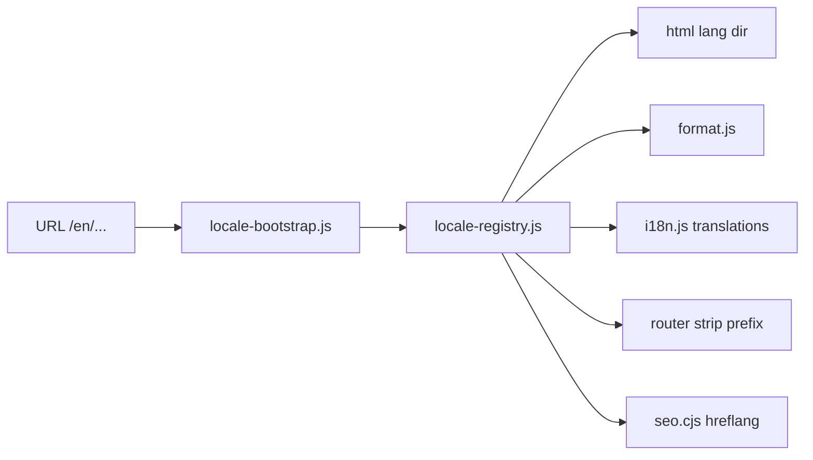

# Global Expansion Readiness

> **Full audit & priority markets (P22):** [INTERNATIONAL_EXPANSION_AUDIT.md](./INTERNATIONAL_EXPANSION_AUDIT.md) · Admin: International Expansion · `npm run metrics:international:audit`

Audit and foundation for isteBul as a **global SaaS** decision platform.

## Current state (after foundation PR)

| Area | Status | Implementation |
|------|--------|----------------|
| **i18n architecture** | Foundation | `js/features/i18n/` + `js/platform/locale-registry.js` |
| **Locale support** | 4 locales | `tr` (default), `en`, `de`, `ar` — `data/i18n/locales.json` |
| **Currency abstraction** | Ready | `js/core/format.js` → `formatMoney()` |
| **Date formats** | Ready | `formatDate`, `formatDateTime`, `formatRelativeTime` |
| **RTL readiness** | Ready | `html.ib-rtl`, `css/rtl.css`, `dir` on `<html>` |
| **SEO localization** | Partial | `hreflang` in `scripts/lib/seo.cjs`, `data/seo/locales.json` |
| **Content structure** | Partial | `data-i18n` keys; most copy still TR-hardcoded |
| **Region routing** | Ready | `/en/*`, `/de/*`, `/ar/*` via `_redirects` + router strip |
| **Pricing localization** | Ready | `js/features/monetization/pricing-localization.js` |

## Architecture



### Resolution order

1. Path prefix (`/en`, `/de`, `/ar`)
2. Query `?lang=`
3. `localStorage` (`istebul_locale`)
4. `navigator.language`
5. Default `tr`

## Usage for developers

```javascript
import { formatMoney, formatDate } from './core/format.js';
import { getActiveLocale, buildLocalizedPath } from './platform/locale-registry.js';
import { i18n } from './features/i18n/i18n.js';

formatMoney(250000); // locale-aware
i18n.t('auth.login');
buildLocalizedPath('/auto/', 'en'); // → /en/auto/
```

### HTML

```html
<span data-i18n="auth.login"></span>
<input data-i18n-placeholder="auth.email" />
<div id="locale-switcher"></div>
```

## SEO checklist (next phase)

- [ ] Per-locale landing copy in `data/seo/landing-pages.{locale}.json`
- [ ] Sitemap `xhtml:link` alternates for all `/rehber/*` URLs
- [ ] `og:locale:alternate` meta tags
- [ ] Corporate pages translated or locale-specific routes

## Stripe / billing (next phase)

- Map `getStripeCurrencyForLocale()` to Checkout sessions
- Price IDs per market in env / Supabase config
- Tax/VAT per region

## Content migration plan

1. Extract top 50 UI strings from `assistant-ui.js` / `index.html` → `translations.js`
2. Category wizard labels → `data/i18n/decision/{locale}.json`
3. AI prompts: `buildDecisionPrompt` locale parameter
4. CMS / Supabase for marketing pages

## RTL QA

Test `/ar/` routes: nav, cards, comparison table, modals. Extend `rtl.css` as new components ship.

## Routing reference

| Locale | Prefix | Example |
|--------|--------|---------|
| tr | — | `/karsilastir` |
| en | `/en` | `/en/karsilastir` |
| de | `/de` | `/de/auto/` |
| ar | `/ar` | `/ar/auto/` |

## Related docs

- `docs/PLATFORM_EXPANSION_ROADMAP.md` — vertical expansion
- `docs/SEO_AUDIT.md` — organic TR focus (extend per locale)
