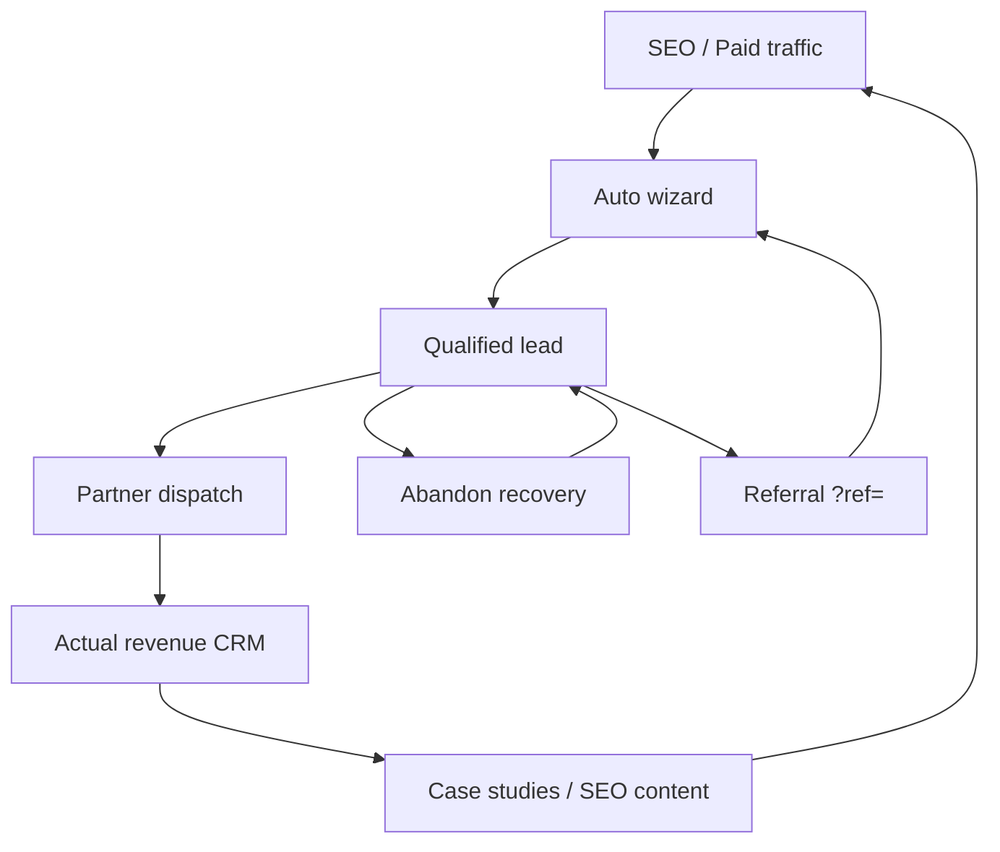

# isteBul Growth Engine

**Goal:** Predictable, measurable growth machine — each channel has inputs, events, KPIs, and owner loops.

**Code:** `js/features/growth/growth-engine.js` · `data/growth/channels.json` · `js/runtime/growth-bootstrap.js`

---

## North star

| Metric | Definition | Source |
|--------|------------|--------|
| **Qualified leads / week** | `auto_lead_submit` + `lead_submit` with score ≥ warm | `auto_leads`, analytics |
| Secondary | Pro trial starts | Stripe + `checkout_completed` |
| Secondary | Partner dispatch success rate | `partner_dispatch_success` / attempts |
| Secondary | Organic sessions | SEO + `utm_medium=organic` |

---

## Growth flywheel



---

## Channel playbooks

### 1. SEO (organic)

**Role:** Top-of-funnel · lowest CAC at scale

| Element | Status |
|---------|--------|
| Rehber landings | 12+ pages `/rehber/*` |
| Hubs | `/karar-asistani/`, `/karsilastir/`, `/auto/` |
| Build | `scripts/lib/seo.cjs` on `npm run build` |

**Weekly rhythm**

1. Publish 1 hub or city landing (backlog: İstanbul, Ankara, İzmir)
2. Internal link from footer + rehber cross-links
3. Track: `organic` sessions → `auto_lead_submit` by `utm_medium=organic`

**KPI:** Organic leads / 1,000 organic sessions

**Doc:** `docs/SEO_AUDIT.md`

---

### 2. Paid acquisition

**Role:** Predictable volume · test creatives & LTV

| Element | Status |
|---------|--------|
| UTM capture | `gclid`, `utm_*` in `analytics.captureAttribution` |
| Conversion events | `auto_lead_submit`, `checkout_started` |
| Retargeting audiences | **Manual** (export from analytics) |

**Launch checklist**

- [ ] Google Ads: brand + non-brand (araç karar asistanı, TCO)
- [ ] Meta: lead form or landing `/auto/`
- [ ] Conversion API → server events (future)
- [ ] Weekly: CAC = spend / qualified leads

**KPI:** Paid CAC · ROAS on partner pipeline value

**UTM template:** `utm_source=google&utm_medium=cpc&utm_campaign={campaign}&utm_content={ad}`

---

### 3. Referral

**Role:** Viral coefficient · trust transfer

| Element | Status |
|---------|--------|
| `?ref=CODE` capture | `growth-bootstrap.js` |
| Persistence | `istebul_referral_code` |
| Lead payload | `metadata.growth` on intake |
| Events | `growth_referral_land`, `growth_referral_convert` |

**Link format:** `buildReferralUrl(code)` → `/auto/?ref=CODE&utm_source=referral`

**Program (operational)**

1. Generate code per user after lead success (future: DB table `referral_codes`)
2. Reward: Pro 1 month / partner priority (policy TBD)
3. KPI: Referral leads / total leads ≥ 15%

---

### 4. Partner acquisition (supply)

**Role:** Monetize demand · improve close rate

| Element | Status |
|---------|--------|
| Partner apply | `partner-olun.html` |
| Dispatch | `partner-dispatch.ts` + CRM |
| Co-marketing UTMs | `utm_source=partner` |

**Rhythm**

1. Onboard 2 dealers + 1 finance partner / month
2. SLA: dispatch &lt; 5 min · callback &lt; 24h
3. KPI: Active endpoints · win rate · actual_revenue

**Doc:** `docs/partner-integration-pack.md`

---

### 5. Lifecycle email

**Role:** Nurture · Pro conversion · return visits

| Element | Status |
|---------|--------|
| Newsletter | Homepage form → `newsletter_subscribe` |
| Transactional | **Not automated** (Supabase/Resend TBD) |
| Event | `growth_email_click` (wire on campaign links) |

**Sequences (build)**

| Email | Trigger | CTA |
|-------|---------|-----|
| Welcome | Register | Auto analiz |
| Results recap | Lead success | Karşılaştır |
| Pro nudge | 3 results, no Pro | `/#pricing` |
| Win-back | 14d inactive | `/auto/?utm_medium=lifecycle` |

**UTM:** `utm_source=email&utm_medium=lifecycle&utm_campaign={sequence}`

---

### 6. CRM reactivation

**Role:** Revive stale pipeline · predictable outbound

| Element | Status |
|---------|--------|
| CRM | Admin `auto_leads` pipeline |
| Filters | follow_up_at, status |
| Event | `growth_crm_touch` (manual log on outbound) |

**Weekly SOP**

1. Filter: `status=new` + `follow_up_at` overdue
2. Call / WhatsApp template
3. Log `growth_crm_touch` + update status
4. Recovery link: `/auto/?recover=crm&phone_hash=...` (no PII in URL)

**KPI:** Reactivated leads / week (return visit + submit)

---

### 7. Abandoned lead recovery

**Role:** Recover high-intent modal drop-offs

| Element | Status |
|---------|--------|
| Detect | `auto_modal_open` → pending flag |
| Abandon event | `growth_lead_abandon` on `pagehide` |
| Recovery land | `?recover=campaign` → `growth_lead_recovery_click` |
| Clear on success | Lead submit |

**Automation (phase 2)**

- Cron: leads with `growth_lead_abandon` + phone → SMS/email
- Template: `buildRecoveryUrl('abandon_24h')`

**KPI:** Recovered leads / abandons ≥ 8%

---

### 8. Retargeting

**Role:** Re-engage warm sessions

| Element | Status |
|---------|--------|
| Audiences | Build from `auto_results_rendered` without `auto_lead_submit` |
| Pixel | Plausible aggregate only — **add Meta/Google pixels** for retargeting |
| UTM | `utm_source=retargeting&utm_medium=display` |

**Audiences**

- Viewed results, no lead (7d)
- Started checkout, no pay (14d)
- Pro churned (30d)

---

### 9. Viral loops

**Role:** Built-in sharing after value moment

| Loop | Mechanism | Status |
|------|-----------|--------|
| Post-lead share | “Arkadaşına öner” + `?ref=` | UI backlog |
| Comparison share | Public compare link | Backlog |
| WhatsApp | `auto_whatsapp_click` | Live |

**Event:** `growth_viral_share` (wire on share buttons)

**KPI:** K-factor = invites × conversion rate

---

## Operating cadence (predictable machine)

| Cadence | Activity | Owner |
|---------|----------|-------|
| **Daily** | CRM follow-ups · partner dispatch failures | Ops |
| **Weekly** | Growth review: funnel + channel KPIs | Growth |
| **Weekly** | 1 SEO content or landing | Content |
| **Bi-weekly** | Paid creative refresh | Performance |
| **Monthly** | Partner onboarding target | BD |

### Weekly growth review agenda (30 min)

1. Admin → Platform Analytics (funnel)
2. Admin → Investor KPIs (MRR + pipeline)
3. Export `node scripts/growth-weekly-report.cjs` (when DB creds set)
4. One channel experiment: hypothesis → UTM → result
5. Update experiment log (Notion / sheet)

---

## Analytics taxonomy

| Category | Events |
|----------|--------|
| `growth` | `growth_referral_*`, `growth_lead_abandon`, `growth_lead_recovery_click`, `growth_email_click`, `growth_crm_touch`, `growth_viral_share` |

Attribution fields: `utm_*`, `ref`, `gclid`, `fbclid`, `growth_campaign`, `growth_channel` (derived).

---

## Experiment framework

```
Hypothesis → UTM campaign → 2 week run → Decision (scale / kill)
```

Log template:

| Field | Example |
|-------|---------|
| Channel | paid |
| Hypothesis | SUV creative lifts lead rate |
| utm_campaign | suv_q2_test |
| Primary metric | auto_lead_submit / sessions |
| Result | +12% CR |

---

## Maturity roadmap

| Phase | Focus |
|-------|--------|
| **Now** | Attribution + events + abandon + referral land |
| **Q+1** | Email automation (Resend/Supabase) · CRM abandon cron |
| **Q+2** | Paid CAPI · retargeting pixels · referral rewards table |
| **Q+3** | Growth warehouse (BigQuery) · cohort dashboards |

---

## Related docs

- `docs/CRO_AUDIT.md`
- `docs/SEO_AUDIT.md`
- `docs/PLATFORM_ANALYTICS_AUDIT.md`
- `docs/investor/UNIT_ECONOMICS.md`
