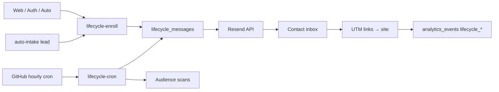

# Lifecycle CRM Automation

**Goal:** Non-manual revenue automation — enroll, schedule, send, and measure across eight flows.

**Stack:** `lifecycle_contacts` · `lifecycle_enrollments` · `lifecycle_messages` · Resend · hourly cron

---

## Flows

| Flow ID | Trigger | Steps | Revenue intent |
|---------|---------|-------|----------------|
| `signup_nurture` | Auth `SIGNED_IN` (once per user) | 0h, 24h, 72h | Activation → Auto → Pro |
| `abandoned_onboarding` | Form started, exit without lead | 2h, 24h, 72h | Complete wizard |
| `abandoned_lead` | Modal abandon / analytics `growth_lead_abandon` | 1h, 24h, 72h | Lead submit |
| `finance_follow_up` | Finance click or finance lead | 4h, 48h | Finance conversion |
| `inactive_users` | Cron: profile inactive 14d+ | 0, 7d | Return visit |
| `upsell_campaigns` | 3+ result sessions, email known, no Pro | 0, 72h | Pro subscription |
| `partner_follow_up` | Lead submit (vehicle) or CRM `follow_up_at` | 0, 24h | Partner close |
| `retention_campaigns` | Cron: subscription canceled/past_due | 0, 3d, 14d | Reduce churn |

Config mirror: `data/lifecycle/flows.json` · edge: `supabase/functions/_shared/lifecycle-flows.ts`

---

## Architecture



---

## API

### Enroll (public flows)

`POST /functions/v1/lifecycle-enroll`

```json
{
  "flow_id": "abandoned_lead",
  "email": "user@example.com",
  "phone": "905551234567",
  "context": { "vehicle": "Toyota Corolla" },
  "trigger_source": "web"
}
```

Public flows: `signup_nurture`, `abandoned_onboarding`, `abandoned_lead`, `finance_follow_up`

Service/webhook: header `x-lifecycle-secret: $LIFECYCLE_WEBHOOK_SECRET` for any flow.

Unsubscribe:

```json
{ "action": "unsubscribe", "email": "user@example.com" }
```

### Cron

`POST /functions/v1/lifecycle-cron` with `x-lifecycle-cron-secret`

Processes due messages + enrolls: partner follow-ups, inactive users, retention, abandon from analytics.

---

## Environment

| Secret | Purpose |
|--------|---------|
| `RESEND_API_KEY` | Send email (skip if missing) |
| `LIFECYCLE_FROM_EMAIL` | Optional sender override |
| `LIFECYCLE_WEBHOOK_SECRET` | Server-to-server enroll |
| `LIFECYCLE_CRON_SECRET` | Cron auth |
| `LIFECYCLE_CRON_URL` | GitHub Actions target |

---

## Client integration

- `js/features/lifecycle/lifecycle-client.js` — enroll helpers
- `js/features/auth/auth.js` — signup nurture
- `js/auto/auto-app.js` — abandon, onboarding, finance, upsell
- `js/features/lifecycle/lifecycle-schedule.js` — pure schedule helpers (tests)

---

## Operations

```bash
npm run metrics:lifecycle   # snapshot pending/sent by flow
npm run test
node --test tests/unit/lifecycle-schedule.test.mjs
```

**Deploy:** `supabase db push` (migration `20260529_lifecycle_crm.sql`) + deploy edge functions `lifecycle-enroll`, `lifecycle-cron`.

**KPIs:** enrollments/week · sent rate · lead recovery after `abandoned_lead` · Pro conversion after `upsell_campaigns`

---

## Compliance

- Unsubscribe sets `lifecycle_contacts.unsubscribed_at` and cancels active enrollments
- No PII in recovery URLs (use `?recover=` + UTM only)
- Rate limit: 8 enrolls/IP/flow/hour on public endpoint
