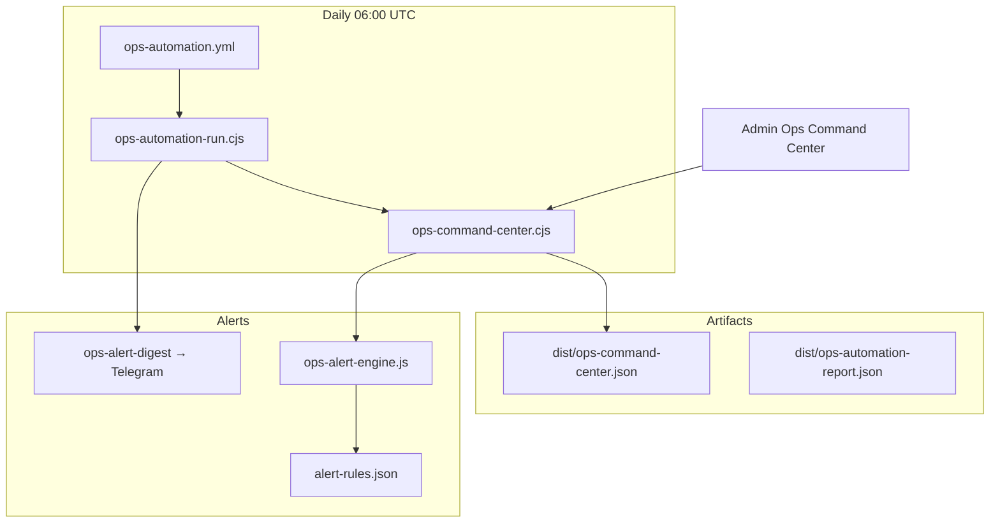

# P9 — Digital Company Ops Automation Roadmap

**Rol:** COO · Revenue Operations Architect · AI Operations Strategist · Automation Architect  
**Tarih:** 2026-05-24  
**Veri:** `data/ops/automation-roadmap.json` · `data/ops/automation-manifest.json` · `data/ops/alert-rules.json`

---

## 1. Operasyon akışları — mevcut durum

### Revenue Ops
| Akış | Otomasyon | Dosya |
|------|-----------|-------|
| Stripe → subscription | ✅ Webhook idempotent | `functions/api/stripe-webhook.js` |
| Checkout → analytics + ops | ✅ | `create-checkout.js`, `record-ops-event.js` |
| MRR / ARR snapshot | ✅ Script + admin KPI | `metrics:executive`, `investor-kpis.js` |
| Partner `actual_revenue` | ⚠️ Manuel CRM | `auto_leads` |

### Customer Ops
| Akış | Otomasyon | Dosya |
|------|-----------|-------|
| Auth + checkout resume | ✅ | `js/features/auth/auth.js` |
| Lifecycle enroll (13+ flow) | ✅ Client + cron | `lifecycle-engine.ts`, `lifecycle-cron` |
| Retention habits | ✅ | `retention-habits.js` |
| Support ticketing | ❌ | Telegram + admin WhatsApp |

### Partner Ops
| Akış | Otomasyon | Dosya |
|------|-----------|-------|
| Intake → score → dispatch | ✅ | `auto-intake` |
| HMAC webhook + retry | ✅ | `partner-dispatch`, `partner-retry.yml` |
| Hot lead Telegram | ✅ | `lead-alert` |
| B2B AE pipeline | ✅ Admin embed | `partner-crm-pipeline.js` |

### Analytics Ops
| Akış | Otomasyon | Dosya |
|------|-----------|-------|
| Event ingest | ✅ | `analytics-ingest` |
| Executive / growth snapshots | ✅ | `metrics:executive`, `metrics:growth:command` |
| Warehouse / BI | ❌ | Sample caps 5k–20k |

### Lifecycle Ops
| Akış | Otomasyon | Dosya |
|------|-----------|-------|
| Hourly send + enroll | ✅ | `.github/workflows/lifecycle-cron.yml` |
| Checkout abandon recovery | ✅ | `checkout_abandon_recovery` |
| Metrics export | ✅ P9 | `metrics:lifecycle` → `dist/` |

### Internal dashboards
| Yüzey | Durum |
|-------|--------|
| Executive KPIs | ✅ `investor-metrics` |
| Observability | ✅ `observability` |
| **Ops Command Center** | ✅ P9 `ops-command-center` |
| Partner dispatch logs | ✅ |

### Operational alerts
| Kanal | Durum |
|-------|--------|
| `operational_events` + rollup | ✅ |
| Sentry (client) | ✅ consent-gated |
| Telegram hot leads | ✅ |
| **Threshold digest** | ✅ P9 `ops-alert-digest` + daily workflow |

### AI-assisted workflows
| Akış | Durum |
|------|--------|
| Deterministic scoring | ✅ `decision-consultant.js` |
| Bounded LLM narration | ✅ `ai-proxy.js` |
| Session budget | ✅ `scale-limits.js` |
| AI ops metrics in command center | ✅ P9 proxy/abuse signal count |

---

## 2. P9 uygulaması (shipped)



| Bileşen | Açıklama |
|---------|----------|
| `buildOpsCommandCenter()` | 8 domain rollup + alert evaluation |
| `evaluateAlertRules()` | Threshold rules from JSON |
| `npm run metrics:ops:center` | Production snapshot export |
| `npm run ops:automation:run` | Daily runner + optional digest |
| Admin **Ops Command Center** | Live pane + runbook links |

---

## 3. Alert kuralları (özet)

| Rule ID | Tetik |
|---------|--------|
| `ops_critical_events` | critical ≥ 1 / 24h |
| `ops_error_spike` | errors ≥ 10 / 24h |
| `partner_dispatch_fails` | webhook fails ≥ 5 |
| `partner_dispatch_rate_low` | dispatch &lt; 70% |
| `revenue_churn_signal` | cancel_at_period_end ≥ 3 |
| `lifecycle_stalled` | failed messages ≥ 5 |

Tam liste: `data/ops/alert-rules.json`.

---

## 4. Faz planı (post-P9)

### P9.1 — Close the loop
- Slack / PagerDuty webhook (ops digest parallel channel)
- `operational_events` 90-day purge cron (`data/compliance/retention-schedule.json`)
- Partner SLA auto-flag in CRM

### P9.2 — Data plane
- Warehouse export job
- Cohort retention automation
- Unified `decision_leads` CRM automation (P8 dependency)

---

## 5. Operasyon komutları

```bash
# Unified command center (requires Supabase service role)
npm run metrics:ops:center

# Daily automation (CI or manual)
npm run ops:automation:run

# Domain snapshots
npm run metrics:executive
npm run metrics:ops
npm run metrics:lifecycle
```

**Secrets (GitHub):** `SUPABASE_URL`, `SUPABASE_SERVICE_ROLE_KEY`, optional `OPS_ALERT_DIGEST_URL`, `OPS_ALERT_WEBHOOK_SECRET`, `TELEGRAM_*` on Supabase for digest function.

---

## 6. İlgili dokümanlar

- [`P9_DIGITAL_COMPANY_OPS.md`](./P9_DIGITAL_COMPANY_OPS.md) — executive summary  
- [`DEPLOYMENT_CHECKLIST.md`](./DEPLOYMENT_CHECKLIST.md)  
- [`EXPANSION_STRATEGY_ROADMAP.md`](./EXPANSION_STRATEGY_ROADMAP.md)

---

*P9 — automation-first digital company foundation on `main`.*
