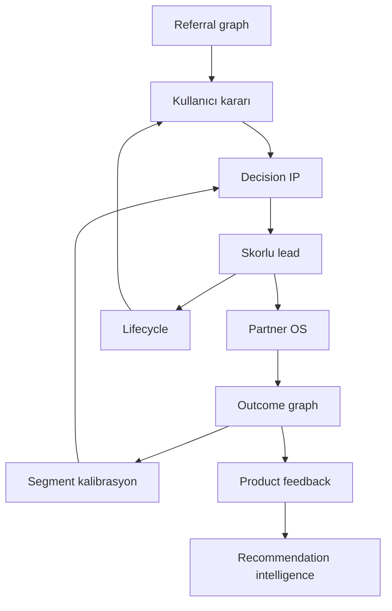

# P3.6 — Long-term moat architecture

**Amaç:** Defensibility — rakibin kopyalama yolunu ve bileşik savunmayı kod + veri + ürün seviyesinde modellemek.

## Rakip nasıl kopyalar?

| Aşama | Süre | Ne kopyalanır | Neden yetersiz |
|-------|------|---------------|----------------|
| 1 | 3–6 ay | Chat UI, “AI araç önerisi”, basit skor | Skor deterministik değil; partner/TCO/outcome yok |
| 2 | 6–12 ay | Lead formu + e-posta drip + NPS | Kapalı döngü yok; outcome graph kirliliği |
| 3 | 12–18 ay | Partner landing + webhook | min_lead_score, retry, CRM kapanış, kalibrasyon eksik |
| 4 | 18–24 ay | Tam flywheel | Operasyonel borç — veri hacmi ve segment k-anonymity |

**Tez:** UI kopyalanır; **bileşik OS** (decision + dispatch + outcome + lifecycle + referral + B2B) kopyalanması zordur.

## Sekiz savunma katmanı

| ID | Katman | Kod / veri | Kopya direnci |
|----|--------|------------|---------------|
| `proprietary_decision_logic` | Deterministik karar motoru | `decision-consultant.js`, `auto-intake` | Yüksek |
| `anonymized_outcome_feedback` | Anonim outcome graph | `outcome_signal_events`, `product_feedback` | Yüksek |
| `partner_conversion_data` | Partner dönüşüm | `auto_leads`, `partner-callback` | Yüksek |
| `recommendation_intelligence` | Öneri zekâsı | `product_feedback`, intelligence events | Orta |
| `decision_confidence_evolution` | Güven bandı evrimi | confidence signals, benchmarks | Orta |
| `lifecycle_intelligence` | Lifecycle CRM | `lifecycle_enrollments`, `lifecycle-cron` | Orta |
| `referral_graph` | Referral graph | `referral_*` tables | Orta |
| `b2b_network_effects` | B2B ağ etkileri | `partner_endpoints`, onboarding | Yüksek |

## Mimari (flywheel)

## Kod yolları

| Bileşen | Path |
|---------|------|
| Layer registry + index | `js/features/moat/moat-architecture-shared.js` |
| UI (admin + `/karar-moat`) | `js/features/moat/moat-architecture-ui.js` |
| Server aggregation | `supabase/functions/_shared/moat-architecture.ts` |
| Health API | `supabase/functions/moat-health` |
| DB snapshot view | `supabase/migrations/20260607_p3_6_moat_architecture.sql` |
| CLI export | `npm run metrics:moat` |

## Defensibility index

0–100 ağırlıklı ortalama (`MOAT_LAYERS[].weight`). Dürüst: erken aşamada düşük skor beklenir; yatırımcıya “birikim yolu” olarak sunulur.

## Ops

1. Migration `20260607_p3_6_moat_architecture.sql`
2. Deploy edge `moat-health`
3. Admin → Auto Leads → moat architecture strip
4. Ürün → `/karar-moat.html` (canlı metrikler API ile hydrate)

## İlgili dokümanlar

- `docs/COMPETITIVE_MOAT_STRATEGY.md`
- `docs/P3_DECISION_MOAT.md`
- `docs/investor/MOAT_AND_DEFENSIBILITY.md`
