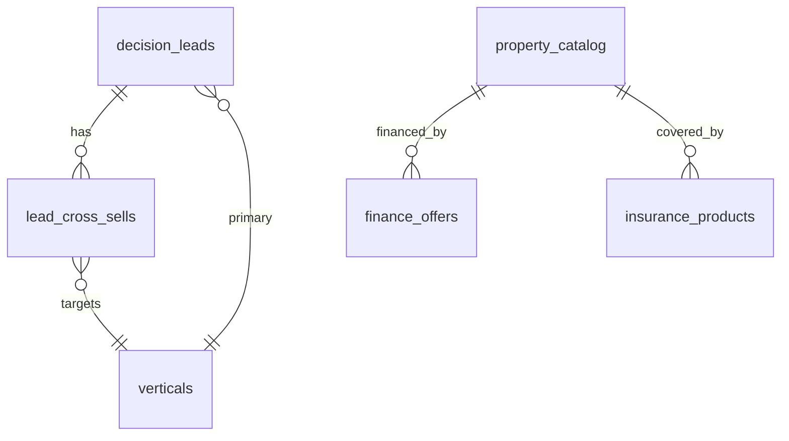

# isteBul Platform Expansion Roadmap

**Hedef:** Tek kategorili “marketplace + araç asistanı” deneyiminden **multi-vertical karar platformuna** geçiş — kullanıcı her büyük satın alma / finansal kararda aynı güvenilir danışman akışını yaşar.

**Kapsam (8 dikey):** konut · kredi · sigorta · tatil · elektronik · eğitim · sağlık · yatırım

**Referans implementasyon:** `isteBul Auto` (`/auto/`) — truth layer, intake, CRM, Pro monetization.

---

## 1. Mevcut durum özeti

| Dikey | Platform kimliği | Karar asistanı | Truth / catalog | CRM / lead | Monetizasyon | Olgunluk |
|-------|------------------|----------------|-----------------|------------|--------------|----------|
| **Konut** | `ev` (konut değil) | Tam wizard + maliyet | Simülasyon | Yok (local history) | Konut kredisi sim. | ~70% |
| **Kredi** | Çapraz (3 kategori içi) | Banka karşılaştırma | Auto: `finance_offers` | Auto-only | Partner finance lead | ~55% |
| **Sigorta** | Maliyet kalemi + link | Yok | Kaynak stub | CRM status only | Partner insurance lead | ~35% |
| **Tatil** | `tatil` | Tam wizard | 42 destinasyon catalog | Yok | Tatil kredisi sim. | ~75% |
| **Elektronik** | DB seed only | Yok | Yok | Yok | Yok | ~5% |
| **Eğitim** | — | Yok | Yok | Yok | Yok | ~0% |
| **Sağlık** | — | Yok | Yok | Yok | Yok | ~0% |
| **Yatırım** | `ev.purpose=investment` | Kullanım amacı only | Yok | Yok | Yok | ~15% |

**Aktif karar kategorileri:** `arac`, `ev`, `tatil` — `js/app.js` → `createDecisionAssistantConfig()`, `js/core/config.js`, `js/data/market-data.js`.

**Kritik mimari borç:**

1. Merkezi **category registry** yok — yeni dikey = 6+ dosya manuel güncelleme.
2. Skorlama ikiye bölünmüş: `decision-consultant.js` (Auto) vs `calculateAssistantScores()` (asistan).
3. **CRM yalnızca `auto_leads`** — ev/tatil kararları Supabase’e gitmiyor.
4. **Market data** tarayıcı `localStorage` — admin/API senkronu yok.
5. **Canlı sağlayıcı** kapalı (`liveProvidersEnabled: false`) — tüm dikeyler simülasyon.
6. SEO içerik Auto-merkezli (`data/seo/`).

---

## 2. Hedef mimari: Multi-vertical decision platform

```mermaid
flowchart TB
  subgraph experience [Experience Layer]
    Hub[Karar Merkezi /]
    VerticalApps["/auto · /konut · /tatil · …"]
    Compare[/karsilastir]
    Pro[isteBul Pro]
  end

  subgraph core [Platform Core]
    Registry[category-registry]
    Wizard[wizard-engine]
    Scoring[decision-consultant]
    Cost[cost-engine]
    Narration[ai-narration + sanitize]
    CompareCore[comparison-store]
  end

  subgraph data [Data Layer]
    Catalog[(vertical_catalog)]
    Truth[(truth_profiles)]
    Leads[(decision_leads)]
    Finance[(finance_offers)]
    Market[(market_data — Supabase)]
  end

  subgraph ops [Operations]
    Admin[admin-panel + CRM]
    Partners[partner-dispatch]
    Analytics[analytics_events]
  end

  Hub --> Registry
  VerticalApps --> Registry
  Registry --> Wizard --> Scoring --> Cost
  Scoring --> Narration
  Wizard --> Leads
  Catalog --> Scoring
  Truth --> Cost
  Admin --> Market
  Admin --> Leads
  Partners --> Leads
  Pro --> experience
```

### 2.1 Platform sözleşmeleri (her dikey implemente eder)

| Sözleşme | Açıklama | Mevcut dosya |
|----------|----------|--------------|
| `VerticalDefinition` | id, slug, displayName, wizardSteps, optionProvider, costEstimator, scoreFn, aiPromptRole | **Yeni:** `js/platform/category-registry.js` |
| `ScoredOption` | title, price, score, scoreBreakdown, confidenceMeta, costs, reasons, risks | `decision-consultant.js` |
| `DecisionLead` | category, answers hash, top picks, consent, partner routing | Genelleştir: `decision_leads` |
| `SourceRef` | name, type, url, cadence, status | `market-data.js` registry |

### 2.2 Dikey türleri

| Tür | Örnek | UX |
|-----|--------|-----|
| **Asset purchase** | konut, arac, elektronik | Bütçe + özellik + TCO |
| **Service / package** | tatil, eğitim, sağlık | Tarih + profil + paket |
| **Financial product** | kredi, sigorta, yatırım | Risk profili + ürün karşılaştırma |
| **Hybrid** | konut + kredi + sigorta | Ana dikey + cross-sell modülleri |

---

## 3. Yeniden kullanılabilir modüller

### 3.1 Hazır (genişlet)

| Modül | Konum | Genişleme |
|-------|--------|-----------|
| Decision Consultant | `js/engines/decision-consultant.js` | `scoreMatch(option, criteria, weights)` generic; dikey-specific weight profilleri |
| Cost engine | `js/engines/cost-engine.js` | Yeni: `estimateEducationCost`, `estimateHealthPlanCost`, … |
| Assistant UI | `js/ui/assistant-ui.js` | Label/action-plan map → registry-driven |
| Comparison | `js/ui/comparison-ui.js` | Zaten category-agnostic |
| AI narration | `js/app.js` + `functions/ai-proxy.js` | Prompt template per `verticalId` |
| Monetization | `js/features/monetization/` | `FREE_LIMITS` → per-vertical quotas |
| Analytics | `analytics_events` | `vertical_id` dimension zorunlu |
| Admin market editor | `js/ui/ui.js` | Supabase-backed market_data |

### 3.2 Yeni (platform)

| Modül | Sorumluluk |
|-------|------------|
| `js/platform/category-registry.js` | Tek kaynak: tüm dikey tanımları |
| `js/platform/wizard-engine.js` | 3-adım wizard; soru setleri registry’den |
| `js/platform/vertical-runtime.js` | `loadVertical(slug)` → bundle lazy load |
| `js/platform/lead-intake.js` | Ortak intake client; edge function router |
| `supabase/functions/decision-intake/` | `category` param → tablo / partner routing |

### 3.3 Auto = golden path

`/auto/` şu an production pattern:

- `vehicle_catalog` + cost truth migrations
- `auto-intake` edge function
- `auto_leads` + CRM (`js/admin/crm.js`)
- `finance_offers`
- Pro preview limits (`FREE_LIMITS.maxAutoResultsPreview`)

**Her yeni dikey**, bu pattern’in kopyası değil — **registry + shared intake** üzerinden türetilmeli.

---

## 4. Veri modeli evrimi

### Faz A — Registry & generic leads (tüm dikeyler için temel)

```sql
-- Örnek: migration 20260601_platform_verticals.sql

CREATE TABLE verticals (
  id text PRIMARY KEY,
  slug text UNIQUE NOT NULL,
  display_name text NOT NULL,
  status text DEFAULT 'draft', -- draft | beta | live
  config jsonb DEFAULT '{}',
  created_at timestamptz DEFAULT now()
);

CREATE TABLE decision_leads (
  id uuid PRIMARY KEY DEFAULT gen_random_uuid(),
  vertical_id text REFERENCES verticals(id),
  user_id uuid REFERENCES auth.users(id),
  answers jsonb NOT NULL,
  recommendations jsonb,
  top_pick_id text,
  consent jsonb,
  partner_status text DEFAULT 'pending',
  notes_history jsonb DEFAULT '[]',
  created_at timestamptz DEFAULT now()
);

CREATE TABLE market_data_snapshots (
  id uuid PRIMARY KEY DEFAULT gen_random_uuid(),
  vertical_id text,
  payload jsonb NOT NULL,
  version int NOT NULL,
  published_at timestamptz
);
```

### Faz B — Dikey catalog / truth tabloları

| Dikey | Tablo (örnek) | Truth alanları |
|-------|---------------|----------------|
| konut | `property_catalog` | m², bölge endeksi, aidat bandı, DASK |
| tatil | `travel_packages` | sezon, konaklama, ulaşım |
| elektronik | `device_catalog` | SKU, enerji, garanti, ikinci el |
| eğitim | `program_catalog` | süre, akreditasyon, işe yerleşme |
| sağlık | `plan_catalog` | kapsam, network, muafiyet |
| yatırım | `instrument_catalog` | risk sınıfı, likidite, ücret |
| kredi | `loan_products` | (mevcut `finance_offers` genişlet) |
| sigorta | `insurance_products` | branş, teminat, prim bandı |

### Faz C — Cross-vertical graph



Örnek: konut kararı → otomatik kredi + DASK + emlak sigortası cross-sell kartları.

---

## 5. UX ölçeklenebilirliği

### 5.1 Bilgi mimarisi

```
/                          → Karar Merkezi (8 dikey grid + son kararlar)
/auto/                     → Araç (mevcut, korunur)
/konut/                    → Konut (ev’den ayrışır, SEO slug)
/tatil/
/kredi/                    → Bağımsız kredi asistanı + mevcut kategorilere embed
/sigorta/
/elektronik/
/egitim/
/saglik/
/yatirim/
/karsilastir               → Tüm dikeylerden sepet
/karar-gecmisi             → Pro: export
```

### 5.2 UX bileşen kütüphanesi (ortak)

| Bileşen | Kullanım |
|---------|----------|
| `DecisionWizard` | 3 adım: konum/ihtiyaç/bütçe |
| `ScoreCard` | skor + confidence + breakdown |
| `MethodologyStrip` | şeffaflık (Auto’daki pattern) |
| `ConsultantSummary` | LLM yorum katmanı |
| `CrossSellRail` | ilişkili dikeyler |
| `LeadCaptureSheet` | mobile-first (mevcut auth sheet pattern) |
| `CompareTray` | floating CTA → `/karsilastir` |

### 5.3 Ölçek kuralları

- Dikey başına **lazy route** + code split (`vertical-runtime.js`).
- Kategori rail **max 8 görünür**; fazlası “Tüm kategoriler” drawer.
- Copy ve metrik etiketleri **registry’den** — `assistant-ui.js` içindeki hard-coded `labelSets` kaldırılır.
- Dark mode / mobile-first / executive polish CSS **platform token**’ları (`css/design-tokens.css` — yeni).

---

## 6. Admin & operasyon

### 6.1 Mevcut

- `js/admin/crm.js` — pipeline `auto_leads`
- `js/admin-panel.js` — listings, analytics, market editor
- `admin-action` edge function

### 6.2 Hedef admin yetenekleri

| Yetenek | Öncelik | Not |
|---------|---------|-----|
| Vertical CMS (soru setleri, ağırlıklar) | P0 | Registry admin UI |
| Unified CRM (`decision_leads` + filtre) | P0 | Dikey kolonu zorunlu |
| Catalog editor (per vertical) | P1 | Auto vehicle editor → generic |
| Market data publish (Supabase) | P1 | localStorage’dan çıkış |
| Partner routing rules | P1 | `partner-dispatch` category param |
| A/B wizard variant | P2 | analytics_events ile |
| Compliance (KVKK, finansal uyarı) | P0 | Dikey bazlı disclaimer şablonları |

### 6.3 CRM pipeline (genelleştirilmiş)

```
yeni → nitelikli → partner_gönderildi → görüşmede → kazanıldı / kayıp
         ↓
    cross_sell: kredi | sigorta | ...
```

Mevcut `insurance` CRM status’u sigorta dikeyi için temel; lead şemasına `vertical_id` eklenmeli.

---

## 7. Monetizasyon potansiyeli

### 7.1 Gelir kanalları (dikey bazlı)

| Dikey | B2C (Pro) | B2B (lead/affiliate) | Premium rapor | Tahmini ARPU potansiyeli |
|-------|-----------|----------------------|---------------|---------------------------|
| **Konut** | Bölge raporu, tapu checklist | Emlak ofisi, mortgage broker | ₺499+ emlak raporu | Yüksek |
| **Kredi** | Oran alarmı, başvuru paketi | Banka / broker CPL | — | Yüksek |
| **Sigorta** | Kapsam karşılaştırma | Poliçe satış CPL | — | Orta-yüksek |
| **Tatil** | Tam paket + AI özet | OTA / tur operatörü | — | Orta |
| **Elektronik** | Fiyat takip, TCO | Marketplace affiliate | — | Orta |
| **Eğitim** | Program eşleştirme | Kurum lead | — | Orta |
| **Sağlık** | Plan karşılator | Sigorta / hastane (dikkat: regülasyon) | — | Orta (KVKK) |
| **Yatırım** | Risk profili raporu | Aracı kurum (SPK uyumu şart) | ₺299+ profil | Yüksek (regülasyon) |

### 7.2 Pro paket evrimi

| Faz | Özellik |
|-----|---------|
| Bugün | Auto odaklı limits (`FREE_LIMITS`) |
| Faz 1 | `pro_verticals: ['arac','konut','tatil']` |
| Faz 2 | Sınırsız karşılaştırma + tüm dikey AI özet |
| Faz 3 | `Pro Plus`: çoklu dikey rapor paketi, API export |

`PARTNER_OFFERS` (`plans.js`) zaten finance + insurance — **sigorta** ve **kredi** dikeyleri partner gelirini doğrudan besler.

### 7.3 Ücretsiz → Pro dönüşüm kancaları

- 3 sonuç limiti (Auto pattern) → dikey başına
- Karşılaştırma 2 seçenek (`maxComparisons`)
- “Danışman özeti” kilitli
- Cross-sell: “Konut kredisi uygunluğu — Pro’da”

---

## 8. Fazlı yol haritası

### Faz 0 — Platform foundation (4–6 hafta teknik iş)

**Çıktı:** Yeni dikey eklemek 1 registry PR + catalog migration ile mümkün.

| # | İş | Dosya / alan |
|---|-----|----------------|
| 0.1 | `category-registry.js` + mevcut 3 kategori migrate | `js/platform/` |
| 0.2 | `decision-consultant` generic scorer + dikey weight profiles | `js/engines/` |
| 0.3 | `decision_leads` + `decision-intake` edge function | `supabase/` |
| 0.4 | Market data → Supabase publish pipeline | admin + migration |
| 0.5 | CRM: vertical filter + unified list | `js/admin/crm.js` |
| 0.6 | Analytics: `vertical_id` on all events | `analytics.js` |
| 0.7 | Dokümantasyon: vertical onboarding checklist | `docs/` |

**Başarı kriteri:** `tatil` kararı Supabase lead oluşturur; admin’de görünür.

---

### Faz 1 — Olgun dikeyleri production parity (konut + tatil)

| Dikey | İşler | Bağımlılık |
|-------|-------|------------|
| **Konut** | `ev` → `konut` slug; `/konut/` app; `property_catalog`; emlak lead; SEO hub | Faz 0 |
| **Tatil** | `/tatil/` app; `travel_packages`; OTA partner intake; SEO | Faz 0 |
| **Kredi** (MVP) | `/kredi/` standalone; `loan_products`; mevcut `createFinanceComparisons` extract | Faz 0 |

**Başarı kriteri:** Konut + tatil Auto ile aynı lead → partner → CRM döngüsü.

---

### Faz 2 — Finansal cross-vertical (kredi + sigorta)

| Dikey | İşler |
|-------|--------|
| **Kredi** | Taşıt / konut / ihtiyaç kredisi tek skor; banka API hazırlığı |
| **Sigorta** | Branş wizard (kasko, DASK, sağlık, seyahat); `insurance_products`; CRM stage |
| **Cross-sell engine** | Konut kararı → kredi + DASK kartları |

**Regülasyon:** Finansal tüketici uyarıları, örnek oran etiketleri (Auto’daki pattern zorunlu).

---

### Faz 3 — Tüketim & yaşam (elektronik, eğitim, sağlık)

| Dikey | Öncelik | Not |
|-------|---------|-----|
| **Elektronik** | P1 | DB seed var; affiliate + TCO kolay |
| **Eğitim** | P2 | Program catalog; kurum lead |
| **Sağlık** | P2 | KVKK + özel sağlık sigortası regülasyonu; hukuk review |

---

### Faz 4 — Yatırım & intelligence

| Dikey | İşler |
|-------|--------|
| **Yatırım** | Risk profili anketi; fon/ETF karşılaştırma; **SPK uyum** gate |
| **Platform AI** | Çoklu dikey bağlam; portföy görünümü (ev + arac + yatırım) |

---

## 9. Dikey detay kartları

### Konut
- **Mevcut:** `ev` wizard, `estimateHomeOwnershipCost`, konut kredisi simülasyonu.
- **Eksik:** Canlı ilan/emlak endeksi, `property_catalog`, `/konut/`, lead intake.
- **Monetizasyon:** Mortgage broker CPL, Pro bölge raporu.

### Kredi
- **Mevcut:** `createFinanceComparisons`, Auto `finance_offers`.
- **Eksik:** Bağımsız vertical, skorlama, başvuru takibi.
- **Monetizasyon:** En yüksek B2B CPL potansiyeli.

### Sigorta
- **Mevcut:** Maliyet satırları, partner offer, CRM `insurance` status.
- **Eksik:** Teminat karşılaştırma motoru, prim truth.
- **Monetizasyon:** Poliçe başına affiliate.

### Tatil
- **Mevcut:** En olgun asistan (42 destinasyon).
- **Eksik:** Dedicated app, travel catalog DB, leads.
- **Monetizasyon:** OTA / tur operatörü lead.

### Elektronik
- **Mevcut:** `categories` seed.
- **Eksik:** Her şey.
- **Monetizasyon:** Marketplace affiliate, fiyat alarmı Pro.

### Eğitim
- **Mevcut:** Yok.
- **Eksik:** Program verisi, kurum partnerleri.
- **Monetizasyon:** Kurum lead, burs affiliate.

### Sağlık
- **Mevcut:** Yok.
- **Eksik:** Plan katalog, KVKK süreçleri.
- **Monetizasyon:** Tamamlayıcı sağlık sigortası (sigorta ile birleşik).

### Yatırım
- **Mevcut:** `ev` purpose = investment.
- **Eksik:** Enstrüman modeli, risk skoru, regülasyon.
- **Monetizasyon:** Yüksek ama SPK sınırı — hukuk öncesi gate.

---

## 10. Riskler ve bağımlılıklar

| Risk | Etki | Azaltma |
|------|------|---------|
| Kategori tanımı dağınık | Yavaş launch | Faz 0 registry zorunlu |
| Regülasyon (kredi, yatırım, sağlık) | Yasal | Dikey bazlı legal review gate |
| Simülasyon güveni | Düşük dönüşüm | Truth layer + canlı provider roadmap |
| CRM sadece Auto | Gelir kaybı | `decision_leads` Faz 0 |
| LLM hallucination | Güven kaybı | Mevcut consultant pattern tüm dikeylerde |
| Admin yükü | Operasyon | CMS + catalog editor |

**Bağımlılıklar:** Faz 1+ için Faz 0 tamamlanmalı. Sigorta/yatırım için hukuk onayı paralel track.

---

## 11. Metrikler (platform KPI)

| KPI | Tanım |
|-----|--------|
| `decisions_completed` | vertical_id, funnel step |
| `lead_capture_rate` | karar → lead |
| `partner_accept_rate` | dispatch → callback success |
| `pro_conversion` | vertical_id at signup |
| `cross_sell_attach` | primary vertical → secondary lead |
| `confidence_tier_distribution` | trust proxy |

---

## 12. Onboarding checklist (yeni dikey)

Yeni bir dikey (ör. `elektronik`) eklerken:

- [ ] `verticals` tablosuna kayıt + `category-registry.js` entry
- [ ] Wizard soruları + `getXDecisionOptions()` catalog
- [ ] `scoreXMatch()` weight profili + cost estimator
- [ ] `market-data` finance/sources/cost profiles
- [ ] `decision-intake` routing + partner rule
- [ ] CRM pipeline stage labels
- [ ] SEO: hub + 2 landing (`data/seo/`)
- [ ] Analytics events listesi
- [ ] Pro / free limit satırı
- [ ] Legal disclaimer şablonu
- [ ] Unit test: scorer + cost smoke

---

## 13. Önerilen sıralama (iş etkisi × hazırlık)

```
1. Faz 0 (platform)     ████████████  Zorunlu temel
2. Konut (/konut/)      ██████████░░  Yüksek gelir, %70 hazır
3. Tatil (/tatil/)      █████████░░░  Hızlı win, %75 hazır
4. Kredi (standalone)   ████████░░░░  Cross-sell merkezi
5. Sigorta              ██████░░░░░░  Partner altyapısı var
6. Elektronik           ████░░░░░░░░  Affiliate kolay
7. Eğitim               ███░░░░░░░░░  Veri toplama gerekir
8. Sağlık               ██░░░░░░░░░░  Regülasyon
9. Yatırım              ██░░░░░░░░░░  SPK gate
```

---

## 14. İlgili dokümanlar

- `docs/SCALE_ARCHITECTURE_ROADMAP.md` — 10k / 100k / 1M ölçek (DB, cache, edge, API)
- `docs/AI_DECISION_ENGINE.md` — skor / güven / LLM katmanı
- `docs/PARTNER_DELIVERY_AUDIT.md` — partner dispatch
- `docs/PLATFORM_ANALYTICS_AUDIT.md` — event model
- `docs/SEO_AUDIT.md` — organik genişleme (dikey hub’lar)

---

*Son güncelleme: platform expansion planning — branch `cursor/platform-expansion-roadmap-0bbd`.*
