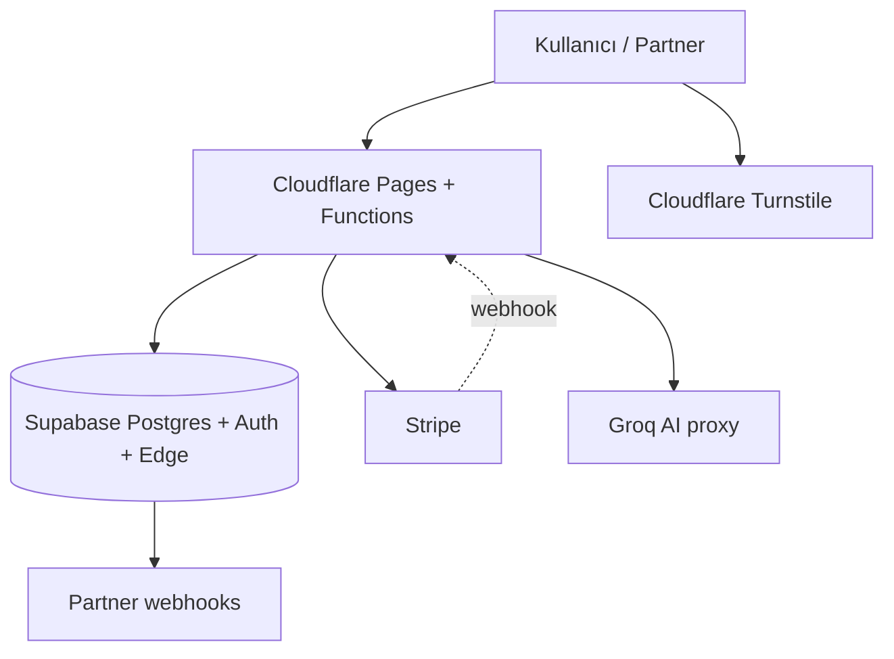
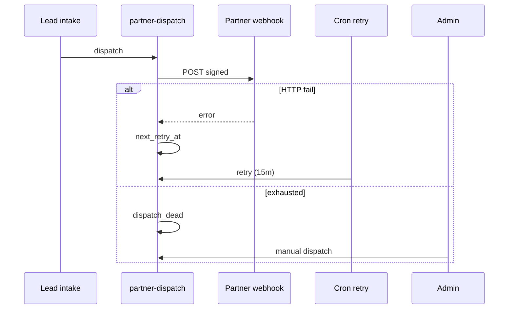

# Production Resilience Audit — İş Sürekliliği (BCP)

**Tarih:** 2026-05-23  
**Kapsam:** isteBul production (`istebul.com`) — Cloudflare Pages + Supabase + Stripe + partner webhooks  
**Amaç:** Tek nokta arızalarını, vendor bağımlılıklarını ve kurtarma boşluklarını görünür kılmak; **iş sürekliliği** için net RTO/RPO ve failover runbook’ları.

**İlişkili:** `docs/LAUNCH_PRODUCTION_AUDIT.md` · `docs/PARTNER_DELIVERY_AUDIT.md` · `docs/PRODUCTION_OBSERVABILITY.md` · `docs/RESILIENCE_RUNBOOK.md`

---

## 1. Executive summary

| Boyut | Durum | Özet |
|-------|--------|------|
| **Genel dayanıklılık** | **Orta** | Partner lead: retry + failover + circuit breaker var; platform tek-region vendor’a bağlı |
| **Kritik SPOF** | **3** | Supabase (auth+DB+edge), Cloudflare (hosting+CDN), Stripe (Pro gelir) |
| **Veri kaybı riski** | **Orta-düşük** | Postgres RLS + migration; **PITR/backup operasyonu doğrulanmalı** |
| **Webhook kurtarma** | **İyi** | Partner 15dk cron + 5 deneme; Stripe idempotency; manuel admin dispatch |
| **Ödeme outage** | **Kısmi** | Checkout hata mesajı + ops event; **degraded mode UX yok** |
| **Failover (multi-cloud)** | **Yok** | Aktif-pasif ikinci region/cloud yok — kabul edilen erken aşama riski |

**Verdict:** Ürün **launch-grade güvenlik** ile canlı; **enterprise BCP** için backup doğrulama, status iletişimi, Stripe/Supabase outage playbook ve deploy bütünlüğü (tüm edge functions) tamamlanmalı.

---

## 2. Mimari bağımlılık haritası



| Bileşen | Rol | Outage etkisi |
|---------|-----|----------------|
| **Cloudflare** | Static site, Pages Functions (Stripe, checkout, AI) | Site tamamen down |
| **Supabase** | Auth, DB, edge (intake, dispatch, analytics) | Giriş, lead, admin, CRM down |
| **Stripe** | Pro checkout + subscription state | Yeni Pro satışı durur; mevcut abonelik Stripe’da |
| **Partner endpoints** | Lead monetization | Lead DB’de kalır; retry/cron kurtarır |
| **Groq** | AI narration only | **Skor/fiyat etkilenmez** — kural motoru çalışır |
| **Plausible** | Analytics | Ürün çalışır |
| **Resend** | Lifecycle email | Email durur; core funnel çalışır |
| **GitHub Actions** | Deploy + partner-retry cron | Retry gecikir; manuel dispatch mümkün |

---

## 3. Single points of failure (SPOF)

### 3.1 SPOF matrisi

| # | SPOF | Etki | Mevcut kontrol | Gap |
|---|------|------|--------------|-----|
| S1 | **Supabase project** | Total platform | RLS, edge functions, rate limits | Multi-region yok; export runbook zayıf |
| S2 | **Cloudflare account/project** | Site + Pages Functions | Global CDN, CI deploy | İkinci CDN/host yok |
| S3 | **Stripe account** | Pro revenue | Webhook idempotency, `subscriptions` table | Checkout degraded UX; offline billing yok |
| S4 | **GitHub `partner-retry` cron** | Otomatik lead retry | 15dk schedule + `workflow_dispatch` | GH outage → retry durur |
| S5 | **Tek `SUPABASE_SERVICE_ROLE`** | Tüm server writes | Secret rotation manual | Leak = full DB access |
| S6 | **Admin panel tek Supabase auth** | Ops | Role gate | Moderator backup admin yok (process) |
| S7 | **Groq / ai-proxy** | AI özet metni | Deterministic engine bağımsız | Düşük — narration fallback metin |

### 3.2 SPOF olmayan (yedekli) bileşenler

| Bileşen | Neden SPOF değil |
|---------|------------------|
| Partner route | `FAILOVER_ROUTES` → `general_sales` zinciri |
| Partner endpoint | Weighted pool + circuit breaker + failover route |
| Lead intake | Rate limit + duplicate 24h; lead DB’de persist |
| Client Supabase down | `createFallbackSupabaseClient()` — **read-only degraded**, auth kapalı |
| AI scoring | `decision-consultant.js` — LLM’siz çalışır |

---

## 4. Supabase dependency risk

### 4.1 Ne Supabase’de?

| Servis | Kritiklik | Kurtarma |
|--------|-----------|----------|
| **Auth** | P0 | Cache yok; outage = login/register kapalı |
| **Postgres** | P0 | Leads, subscriptions, analytics, ops events |
| **Edge Functions** | P0 | `auto-intake`, dispatch, analytics, lifecycle, ops |
| **Realtime** | P2 | Kullanılmıyor / minimal |
| **Storage** | P2 | Görseller — placeholder fallback |

### 4.2 Riskler

1. **Regional outage** — Supabase status sayfası; tek proje = tek bölge.
2. **Connection pool / rate limit** — Spike’da edge timeout; `operational_events` ile izlenir.
3. **Migration drift** — CI’da `SUPABASE_ACCESS_TOKEN` yoksa migration deploy atlanır (**bilinen gap**).
4. **RLS misconfig** — Launch audit mitigated; regression test gerekir.

### 4.3 Önerilen hedefler

| Metrik | Hedef (öneri) | Not |
|--------|---------------|-----|
| **RPO** (veri) | ≤ 1 saat | Supabase Pro **PITR** açık olmalı |
| **RTO** (platform) | ≤ 4 saat | Restore + edge redeploy |
| **RTO** (read-only marketing) | ≤ 30 dk | Cloudflare static cache (sınırlı) |

### 4.4 Aksiyonlar

| Öncelik | Aksiyon |
|---------|---------|
| P0 | Supabase Dashboard → **Backups / PITR** doğrula; tarih notu data room’a |
| P0 | Haftalık `pg_dump` veya Supabase scheduled backup export (legal/compliance) |
| P1 | `SUPABASE_ACCESS_TOKEN` + `SUPABASE_DB_PASSWORD` CI secrets zorunlu |
| P1 | `supabase functions deploy` listesinde **tüm** production functions |
| P2 | Read replica / second project DR (staging → promote) — scale aşaması |

---

## 5. Stripe outage handling

### 5.1 Mevcut davranış

| Akış | Outage davranışı |
|------|------------------|
| **Checkout başlat** | `create-checkout.js` → 502 + `payment_checkout_failed` ops event |
| **Client** | `app.js` kullanıcıya hata toast |
| **Webhook** | Stripe queue; signature fail → 400 + ops log |
| **Idempotency** | `stripe_webhook_events` insert-before-process |
| **Pro state** | `subscriptions` + `revenueManager.refresh` — webhook gecikmesi → kısa süre sync gecikmesi |

### 5.2 Gap’ler

- Stripe Dashboard / API down iken **“Pro geçici kapalı”** banner yok.
- Mevcut aboneler: Stripe billing portal erişilemez — **support playbook** gerekir.
- `invoice.payment_failed` → ops event var; otomatik grace period **yok**.

### 5.3 Failover / degraded mode (önerilen)

```text
Stripe status ≠ operational
  → Site: static pricing + "Ödeme sistemi bakımda" + lead funnel AÇIK
  → Admin: manual Pro grant (admin-action / DB) — process only
  → Webhook backlog: Stripe auto-retry; idempotency korur
```

| Öncelik | Aksiyon |
|---------|---------|
| P1 | `status.stripe.com` + health check in weekly ops |
| P1 | Admin runbook: manual subscription row update (documented) |
| P2 | Feature flag `payments_disabled` in runtime env |

---

## 6. Cloudflare dependency risk

### 6.1 Mevcut

- **Pages** — `dist/` static + `/functions` (Stripe, checkout, ai-proxy).
- **CDN / WAF / DDoS** — Cloudflare edge.
- **Turnstile** — Abuse; outage → intake 403 (fail-closed).
- **Deploy** — GitHub Actions `wrangler pages deploy` veya CF Git integration.

### 6.2 Riskler

| Risk | Etki | Mitigation |
|------|------|------------|
| CF global incident | Site down | Status page; Twitter comms |
| Pages Functions cold start | Latency spike | Observability LCP |
| Secret misconfig on deploy | Broken checkout | CI `verify-deploy-setup` |
| **Only CF** hosts frontend | No alternate origin | Accept or Netlify standby (cold) |

### 6.3 Aksiyonlar

| Öncelik | Aksiyon |
|---------|---------|
| P1 | Public status: `status.cloudflare.com` subscription |
| P2 | Quarterly restore test: redeploy `dist` from artifact |
| P3 | Secondary static host (S3+CloudFront) — DR only |

---

## 7. Webhook failure recovery

### 7.1 Partner lead webhooks

| Mekanizma | Detay |
|-----------|--------|
| **Immediate** | `dispatchPartnerLead` → log `partner_lead_dispatch_logs` |
| **Failover** | Route chain `dealer_partner` → `general_sales` |
| **Circuit breaker** | `circuit_open_until`, `health_status` degraded/unhealthy |
| **Retry schedule** | `dispatch_retry_count` < 5, `next_retry_at` exponential |
| **Cron** | `.github/workflows/partner-retry.yml` — **15 dakika** |
| **Manual** | Admin → retry-dispatch / manual-dispatch |
| **Dead letter** | `partner_status = dispatch_dead` after 5 fails |
| **Ops** | `webhook_partner_dispatch_failed` / `_exhausted` |



### 7.2 Stripe webhooks

| Mekanizma | Detay |
|-----------|--------|
| Stripe retry | Platform default (hours) |
| Idempotency | `stripe_webhook_events.event_id` unique |
| Failure | 500 → Stripe retries; ops `webhook_stripe_processing_failed` |

### 7.3 Gap’ler

- GitHub Actions down → partner retry durur → **manual cron** (`curl partner-retry`) runbook.
- `lead-alert` Telegram — optional; failure silent if env missing.
- Lifecycle email queue — ayrı cron (`lifecycle-cron`); GH secret gerekir.

### 7.4 Aksiyonlar

| Öncelik | Aksiyon |
|---------|---------|
| P0 | `docs/RESILIENCE_RUNBOOK.md` — manual retry curl |
| P1 | Secondary cron (Supabase `pg_cron` or CF cron trigger) |
| P1 | Alert: `dispatch_dead` count > 0 in 1h |

---

## 8. Backup strategy

### 8.1 Mevcut (kod / platform)

| Veri | Backup kaynağı | Kodda |
|------|----------------|-------|
| Postgres | Supabase managed backups (plan-dependent) | Migration SQL in git |
| Auth users | Supabase Auth export | — |
| Static site | Git `main` + CI artifacts | `dist/` reproducible build |
| Secrets | GitHub Secrets, CF env, Supabase secrets | Not in repo ✓ |
| Analytics | `analytics_events` in DB | Export script partial |

### 8.2 Gap’ler

- **No documented RPO/RTO** in repo until this audit.
- No automated **off-site** DB export to R2/S3.
- `localStorage` decision history — **user device only**, not backed up server-side.

### 8.3 Önerilen backup katmanları

| Katman | Sıklık | Saklama |
|--------|--------|---------|
| Supabase PITR | Continuous (Pro) | 7+ gün |
| Logical dump (`pg_dump`) | Günlük | 90 gün encrypted object storage |
| Git + migration | Her commit | Indefinite |
| Investor/ops snapshots | Haftalık | `metrics:investor`, `metrics:ops` JSON |
| Stripe data | Stripe Dashboard | Billing source of truth |

---

## 9. Data recovery

### 9.1 Senaryolar

| Senaryo | Prosedür | RTO tahmini |
|---------|----------|-------------|
| **Yanlış admin UPDATE** | `admin_audit_logs` + PITR point-in-time | 1–4 saat |
| **Lead tablosu bozulması** | PITR veya dump restore → staging validate | 2–8 saat |
| **Edge function bad deploy** | Redeploy previous git SHA | 15–30 dk |
| **Stripe desync** | Reconcile `subscriptions` from Stripe API | 1–2 saat |
| **Accidental RLS lockout** | Migration rollback / emergency policy SQL | 30–60 dk |

### 9.2 Restore test (yıllık)

1. Staging project’e son dump restore.
2. `auto_leads` count + sample row checksum.
3. Edge smoke: `auto-intake` test lead (test phone).
4. Document results in data room.

### 9.3 Veri export (vendor lock-in azaltma)

```bash
# Operational snapshot (no full DB)
SUPABASE_URL=... SUPABASE_SERVICE_ROLE_KEY=... npm run metrics:ops
SUPABASE_URL=... SUPABASE_SERVICE_ROLE_KEY=... npm run metrics:investor
```

Full export: Supabase CLI / Dashboard Table export for `auto_leads`, `subscriptions`, `profiles`.

---

## 10. Failover workflows (operasyon)

| # | Workflow | Tetikleyici | Sahip | Araç |
|---|----------|-------------|-------|------|
| F1 | Partner dispatch stuck | `dispatch_failed` > N | Ops | Admin retry + cron |
| F2 | Supabase degraded | status.supabase.com | Eng | Status comms; read-only mode |
| F3 | Stripe down | status.stripe.com | Ops/Growth | Disable checkout CTA; leads continue |
| F4 | Cloudflare down | status.cloudflare.com | Eng | Wait / comms; no code failover |
| F5 | Mass auth failure | `auth_*` ops spike | Eng | Supabase Auth logs |
| F6 | Abuse spike | `abuse_*` ops | Ops | Turnstile + rate limits + CF WAF |
| F7 | Migration failed deploy | CI red | Eng | Fix SQL; `db push`; never edit prod ad-hoc without migration |

Detay adımlar: **`docs/RESILIENCE_RUNBOOK.md`**

---

## 11. İş sürekliliği hedefleri (önerilen SLA iç)

| Süreç | Minimum viable | Hedef |
|-------|----------------|-------|
| **Lead capture** | Form submit → DB (Supabase up) | 99.5% / ay |
| **Hot lead dispatch** | < 5 dk ilk deneme | 99% success within 24h |
| **Pro checkout** | Stripe up | 99% |
| **Public site** | Static + CF | 99.9% |
| **Admin CRM** | Auth + Supabase | Business hours 99.5% |

---

## 12. Öncelikli iyileştirme backlog

| ID | Öncelik | İyileştirme | Efor |
|----|---------|-------------|------|
| R-A1 | P0 | Supabase backup/PITR doğrulama + dokümantasyon | Ops 2h |
| R-A2 | P0 | CI: tüm edge functions deploy listesi | Eng 1h |
| R-A3 | P0 | Resilience runbook + on-call curl örnekleri | Ops 2h |
| R-A4 | P1 | `dispatch_dead` alerting (Observability / Sentry) | Eng 4h |
| R-A5 | P1 | Stripe degraded mode banner (env flag) | Eng 4h |
| R-A6 | P1 | Secondary partner-retry trigger (CF Cron) | Eng 4h |
| R-A7 | P1 | Quarterly restore drill | Ops 4h |
| R-A8 | P2 | Public status page (instebul.status) | Eng 1d |
| R-A9 | P2 | Off-site pg_dump to R2 | Eng 1d |
| R-A10 | P2 | Multi-region DR project | Eng 1–2 hf |

---

## 13. Mevcut güçlü yönler (özet)

1. Partner delivery: **failover routes, circuit breaker, dispatch logs, 5x retry, admin manual dispatch**.
2. Payments: **Stripe signature + idempotency table**.
3. Security: **RLS deny-by-default, SSRF webhook validation, rate limits**.
4. Observability: **`operational_events` + Admin Observability + Sentry**.
5. Product: **Deterministic decision engine** — Groq outage ≠ core value loss.
6. Deploy: **CI test gate** before Cloudflare push.

---

## 14. Referanslar

| Doküman | Konu |
|---------|------|
| `docs/SCALE_ARCHITECTURE_ROADMAP.md` | 10k / 100k / 1M büyüme mimarisi |
| `docs/RESILIENCE_RUNBOOK.md` | Operasyon adımları |
| `docs/PRODUCTION_OBSERVABILITY.md` | İzleme |
| `docs/PARTNER_DELIVERY_AUDIT.md` | Webhook mimarisi |
| `docs/investor/RISK_REGISTER.md` | R7 vendor lock-in |
| `.github/workflows/partner-retry.yml` | Retry cron |
| `supabase/functions/_shared/partner-dispatch.ts` | Failover kodu |
