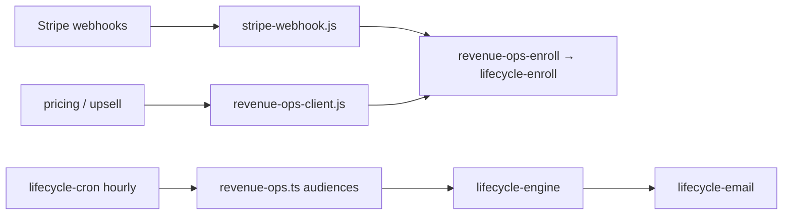

# Revenue Ops Automation (P10)

**Goal:** Reduce MRR leakage with automated payment recovery, dunning, renewal comms, churn rescue, downgrade save, and upgrade prompts.

## Flow matrix

| Flow | Trigger | Channel |
|------|---------|---------|
| **Failed payment recovery** | `invoice.payment_failed` | Email 0h / 24h / 72h → billing portal |
| **Dunning (past due)** | `past_due` status or failed invoice | Email urgent + 48h + 120h |
| **Invoice reminder** | Cron ~7 days before `current_period_end` | Email 7d / 3d / 1d narrative |
| **Renewal nudge** | Cron ~14 days before period end | Email 14d + 7d |
| **Churn rescue** | `cancel_at_period_end` or subscription deleted | Email save sequence |
| **Downgrade save** | Cancel scheduled on subscription | Email Pro value + offer |
| **Upgrade prompt** | Pricing view / cron engaged free users | Email → `/planlar` |
| **Trial ending** | `customer.subscription.trial_will_end` + cron | Email before trial ends |
| **Checkout abandon** | Existing `checkout_abandon_recovery` | Unchanged |

## Architecture



## Operations

- **Secrets:** `LIFECYCLE_WEBHOOK_SECRET` on Cloudflare (Stripe webhook) and Supabase edge.
- **Stripe:** Enable `customer.subscription.trial_will_end` on webhook endpoint.
- **Cron:** RevOps audiences run inside existing hourly `lifecycle-cron` workflow.

## Config

- `data/revenue/revops-flows.json` — flow catalog
- `data/lifecycle/flows.json` — step definitions (sync with `lifecycle-flows.ts`)

## Verify

```bash
node scripts/p10-revops-automation-audit.cjs
npm test
```
