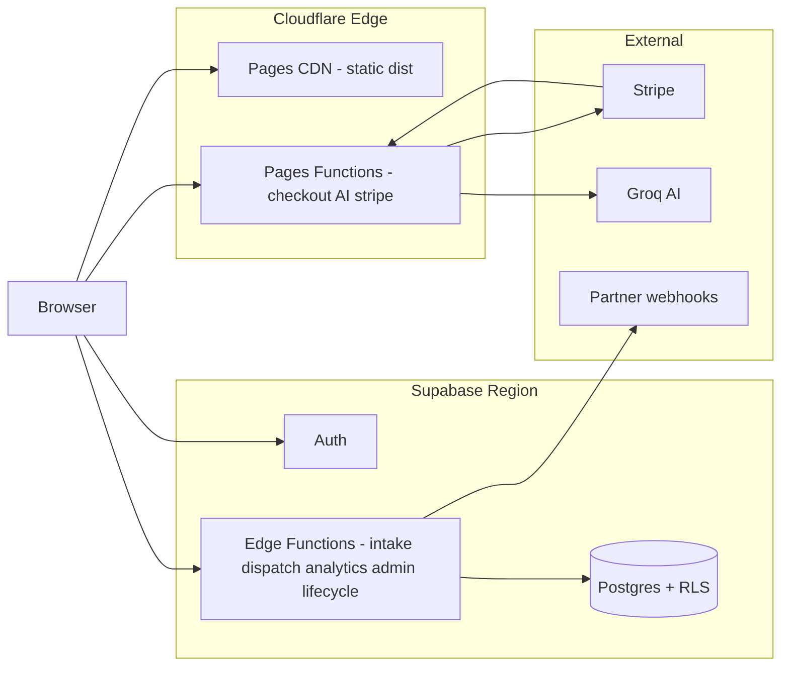
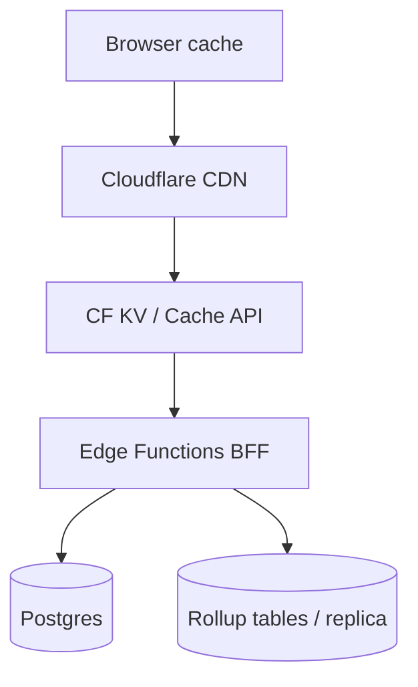

# Scale Architecture Roadmap

**Product:** isteBul — decision intelligence platform  
**Production:** Cloudflare Pages + Pages Functions + Supabase (Postgres, Auth, Edge Functions)  
**Goal:** Growth-ready platform — predictable cost, latency, and operability from **10k → 100k → 1M** scale.

**Related:** `docs/ARCHITECTURE.md` · `docs/PRODUCTION_RESILIENCE_AUDIT.md` · `docs/PLATFORM_EXPANSION_ROADMAP.md`

---

## 1. Definitions & assumptions

| Term | Definition (this roadmap) |
|------|---------------------------|
| **User** | Registered account (`auth.users`) unless noted |
| **MAU** | Distinct identity with ≥1 `analytics_events` or authenticated session in 30 days |
| **Peak RPS** | Sustained 1-minute average at daily peak (Turkey + EU evening bias) |
| **Lead** | `auto_leads` row (intake + CRM) |

**Traffic model (order-of-magnitude):**

| Tier | Registered users | MAU (≈) | Peak RPS (edge+API) | Leads / month |
|------|------------------|---------|---------------------|---------------|
| **10k** | 10,000 | 3–5k | 5–15 | 500–2k |
| **100k** | 100,000 | 25–40k | 50–150 | 5k–20k |
| **1M** | 1,000,000 | 200–350k | 500–2k | 50k–200k |

Assumptions: Auto funnel is primary compute path; multi-vertical expansion (`PLATFORM_EXPANSION_ROADMAP.md`) increases catalog + lead volume ~1.5× per new live vertical.

---

## 2. Current baseline (as-is)



| Layer | Today | Scale limit (practical) |
|-------|--------|-------------------------|
| **Frontend** | esbuild ESM bundles (`app`, `auto`, `admin-panel`); hashed JS/CSS `immutable` | Large `app.js` — parse/execute on mid mobile |
| **Edge (CF)** | Static assets global; `/api/*` checkout, webhook, `ai-proxy` | Function CPU/time; no KV/D1 yet |
| **API** | Supabase Edge Functions + `admin-action` gateway | Cold starts; Postgres round-trips per request |
| **Database** | Single Postgres; RLS; rate limits in `auto_rate_limits` table | Connections, write-heavy analytics, index bloat |
| **Caching** | CDN for `/assets`, `/*.js`, `/*.css`; HTML `no-store` | No API response cache; no rollup layer |
| **Observability** | `operational_events`, Sentry, admin Observability | No SLO dashboards wired to paging |

---

## 3. Tier summary — what changes when

| Dimension | **10k** — stabilize | **100k** — optimize | **1M** — redesign hot paths |
|-----------|---------------------|---------------------|-----------------------------|
| **Frontend** | Bundle budget; lazy routes; RUM | Split `app.js`; vertical chunks; prefetch Auto | Federated modules or SSR shell; edge-personalized static |
| **Backend** | SLOs + load tests; function inventory deploy | Queues for dispatch/lifecycle; idempotent workers | Service boundaries per domain (leads, billing, analytics) |
| **Database** | Indexes + PITR; slow-query log | Partition `analytics_events`; rollups; Supavisor pool | Read replicas / analytics warehouse; archive cold leads |
| **Caching** | HTTP cache headers audit | CDN cache API GETs; materialized KPI views | Multi-layer: edge KV + Redis + CQRS read models |
| **API** | BFF via `admin-action`; rate limits | Public read API + GraphQL/REST gateway | Event-driven internal APIs; versioned contracts |
| **Edge** | Turnstile + WAF rules | Move rate limit + geo to CF; cache AI prompts | Durable Objects coordination; edge BFF aggregation |

**Verdict by tier:**

- **10k:** Current architecture is **sufficient** with monitoring, indexes, and deploy discipline.  
- **100k:** **Required** analytics partitioning, connection pooling, async partner pipeline, frontend bundle split.  
- **1M:** **Required** read path separation, edge caching layer, and bounded contexts — not a single monolith DB for everything.

---

## 4. Frontend scalability

### 4.1 Bottlenecks today

| Issue | Impact | Evidence |
|-------|--------|----------|
| Monolithic main bundle | TTI on 3G | `js/app.js` + esbuild `splitting: true` but large entry |
| Supabase client on every page | Connection setup, JS weight | `importmap` CDN `@supabase/supabase-js` |
| No route-level code splitting for verticals | Loads ev/tatil logic when only Auto needed | `js/app.js` decision assistant |
| `content-visibility` partial | Good for below-fold | `style.css` sections |
| HTML `no-store` | Fresh CMS/auth; less CDN offload for documents | `_headers` |

### 4.2 Roadmap

| Action | 10k | 100k | 1M |
|--------|-----|------|-----|
| Bundle size budget (gzip) | App ≤180KB, Auto ≤120KB | App ≤120KB initial | Per-route ≤80KB initial |
| Lazy `import()` vertical modules | P1 | P0 | P0 |
| Keep Auto standalone (`auto.bundle`) | ✓ | ✓ | ✓ |
| `modulepreload` only critical path | ✓ | ✓ | + link rel prefetch on hub |
| Image pipeline (WebP/AVIF, dimensions) | P1 | P0 | P0 |
| RUM → Core Web Vitals (LCP, INP) | P0 | P0 | SLO-backed |
| Service worker: offline shell only (no stale API) | P2 | P1 | P1 |
| Optional SSR/SSG marketing (CF Pages or Workers) | P2 | P1 | P0 for SEO at scale |

### 4.3 Targets (p75 mobile)

| Metric | 10k | 100k | 1M |
|--------|-----|------|-----|
| LCP | <2.5s | <2.0s | <1.8s |
| INP | <200ms | <150ms | <100ms |
| JS initial (gzip) | <200KB | <140KB | <100KB |

---

## 5. Backend scalability

### 5.1 Workloads

| Path | Handler | Dominant cost |
|------|---------|---------------|
| Lead intake | `auto-intake` | Postgres writes + Turnstile + optional Telegram |
| Partner dispatch | `partner-dispatch`, `partner-retry` | HTTP outbound + retries |
| Analytics | `analytics-ingest` | Write amplification to `analytics_events` |
| Admin CRM | `admin-action` | Service-role reads up to 1000 rows |
| Lifecycle | `lifecycle-cron`, `lifecycle-enroll` | Batch email + enrollment scans |
| Payments | CF `stripe-webhook`, `create-checkout` | Stripe + idempotent webhook table |
| AI | CF `ai-proxy` | Groq latency + token cost |

### 5.2 Roadmap

| Action | 10k | 100k | 1M |
|--------|-----|------|-----|
| Load test intake + analytics (k6) | P0 | Quarterly | Continuous in CI |
| Standardize timeouts (edge ≤30s, partner HTTP ≤10s) | P0 | ✓ | ✓ |
| **Async queue** for partner dispatch (pg_net / CF Queue / external) | P2 | P0 | P0 |
| Separate **cron workers** from user-facing functions | P1 | P0 | P0 |
| Webhook ingestion: insert queue row → worker | P2 | P1 | P0 |
| Horizontal scale: stateless functions only | ✓ | ✓ | Multi-region active-active (read) |
| Feature flags (`payments_disabled`, `ai_disabled`) | P1 | P0 | P0 |

### 5.3 Concurrency model

```text
10k:   Sync request → Postgres (OK)
100k:  Sync accept → queue → worker (partner, email, heavy AI)
1M:    Event bus (leads.*, billing.*) → dedicated consumers
```

---

## 6. Database bottlenecks

### 6.1 Hot tables (projected)

| Table | Growth | Risk at 100k+ |
|-------|--------|---------------|
| `analytics_events` | Unbounded, high insert rate | Disk, index size, admin export scans |
| `analytics_sessions` | Moderate | Upsert churn |
| `auto_leads` | Business-critical | CRM list queries, partner filters |
| `operational_events` | Ops telemetry | Retention policy needed |
| `lifecycle_*` | Email automation | Batch job table scans |
| `auto_rate_limits` | Per-IP/key | Row contention if not edge-offloaded |
| `subscriptions` | Low | OK |
| `stripe_webhook_events` | Medium | OK with retention |

### 6.2 Index & query hygiene (10k — do now)

| Action | Priority |
|--------|----------|
| Confirm indexes on `analytics_events(event_name, created_at)`, `session_id`, `user_id` | P0 |
| Confirm `auto_leads(created_at)`, `(partner_status)`, `(lead_score)` | P0 |
| `EXPLAIN ANALYZE` on admin list queries | P0 |
| Enable Supabase **query performance** + slow log alerts | P0 |
| **Supavisor** transaction pooler for edge functions | P1 @10k, P0 @100k |

### 6.3 Partitioning & rollups (100k+)

| Action | When |
|--------|------|
| Partition `analytics_events` by month (`created_at`) | 100k MAU |
| Nightly rollup tables: `analytics_daily_active`, `funnel_daily` | 100k |
| Replace admin full scans with **materialized views** (extend `investor_metrics_views.sql`) | 100k |
| Archive `analytics_events` >90d to cold storage (R2 / BigQuery export) | 100k |
| Separate **read replica** or Supabase analytics DB for BI | 1M |

### 6.4 Connection & write limits

| Tier | Postgres connections | Mitigation |
|------|----------------------|------------|
| 10k | Pooler optional | Monitor `pg_stat_activity` |
| 100k | Pooler **required** | Supavisor; cap edge function concurrency |
| 1M | Shard or split DB | Leads OLTP vs analytics OLAP |

---

## 7. Caching strategy

### 7.1 Current (`_headers`)

| Asset | Policy | Fit |
|-------|--------|-----|
| `/assets/*`, `/*.js`, `/*.css` | `immutable, 1y` | Excellent |
| HTML, `/auto`, `env.js` | `no-store` | Correct for auth/env freshness |
| `/api/*` | `no-store` | Correct for checkout |

### 7.2 Layered cache plan



| Layer | What to cache | TTL | Tier |
|-------|---------------|-----|------|
| **CDN** | Hashed static, SEO pages (optional SSG) | 1y / 1h | 10k+ |
| **CDN Cache API** | Public catalog JSON, finance offers read-only | 60–300s | 100k |
| **Edge KV** | Rate limit counters, feature flags, AI prompt templates | seconds–hours | 100k |
| **Postgres** | Materialized views for KPI/admin | refresh 5–60 min | 100k |
| **Client** | `localStorage` market data (today) → migrate to versioned HTTP cache | version key | 10k |
| **Do not cache** | PII, leads, auth, checkout, webhooks | — | always |

### 7.3 Cache invalidation

| Data | Strategy |
|------|----------|
| CMS / announcements | Short TTL (60s) or purge on admin publish |
| Catalog / market data | `ETag` + `max-age=300` |
| User session | Never CDN-cache |
| Executive metrics | Admin reads rollups only |

---

## 8. API architecture

### 8.1 Today

| Pattern | Use |
|---------|-----|
| **Direct Supabase** (anon + RLS) | Listings, profile read |
| **Edge Functions** | Intake, analytics, partner, lifecycle |
| **`admin-action`** | Admin list/mutate (service role behind JWT + role check) |
| **CF Pages Functions** | Stripe, AI proxy |

**Gaps for scale:**

- No versioned public API (`/v1/...`).  
- Admin `list` cap 1000 — no cursor pagination contract.  
- Analytics ingest synchronous write per event batch.  
- Rate limits hit Postgres (`auto_rate_limits`).

### 8.2 Target evolution

| Phase | API shape |
|-------|-----------|
| **10k** | Document internal contracts; OpenAPI for edge functions |
| **100k** | **BFF** on Cloudflare Worker aggregates dashboard reads; cursor pagination everywhere |
| **1M** | Public **read API** (API keys) + internal gRPC/HTTP services; event webhooks for partners |

### 8.3 Pagination & limits (standard)

```typescript
// Target contract (admin + public lists)
{ items, next_cursor, limit }  // max limit 100 default 50
```

| Endpoint class | Default limit | Max |
|----------------|---------------|-----|
| Admin CRM | 50 | 100 |
| Analytics export | batch | 5000 (service role, async job) |
| Public catalog | 100 | 200 |

### 8.4 Idempotency (scale-critical)

| Flow | Key |
|------|-----|
| Stripe webhook | `stripe_webhook_events` ✓ |
| Analytics | `idempotency_key` on `analytics_events` ✓ |
| Lead intake | Add client `Idempotency-Key` @100k |
| Partner dispatch | `lead_id` + `endpoint_id` dedupe |

---

## 9. Edge compute opportunities (Cloudflare)

### 9.1 Fit matrix

| Workload | Run at edge? | Why |
|----------|--------------|-----|
| Static + marketing | **Yes** (Pages) | Already |
| Turnstile verify | **Yes** | Low latency, abuse close to user |
| Rate limiting | **Yes** (KV / WAF) | Offload Postgres `@100k` |
| AI proxy | **Yes** (Pages Fn) | Keep; add KV cache for identical prompts |
| Checkout session create | **Yes** | Keep Stripe server-side |
| Lead intake validation | **Partial** | Schema + bot check at edge; persist Supabase |
| Heavy scoring / TCO | **No** (browser + engine) | CPU in client; optional Worker for server truth |
| CRM / admin writes | **No** | Auth + audit in Supabase region |
| Lifecycle email | **No** | Use queue + Resend from worker region |
| Analytics aggregation | **Partial** | Edge sampling → batch insert |

### 9.2 Recommended CF additions

| Capability | Tier | Purpose |
|------------|------|---------|
| **WAF rate rules** | 10k | Burst protection |
| **KV** | 100k | Rate limits, feature flags |
| **Queues** | 100k | Partner dispatch backlog |
| **Durable Objects** | 1M | Per-tenant rate limit / session coordination |
| **D1** (optional) | 1M | Edge config catalog — not primary OLTP |
| **Workers Analytics Engine** | 100k | High-cardinality metrics without Postgres insert |

### 9.3 Multi-region note

Cloudflare is global; **Supabase is regional**. At 1M, pattern:

```text
Edge (global) → accept + validate + enqueue
Region (TR/EU) → authoritative Postgres writes
Replica (EU) → read-only dashboards (optional)
```

---

## 10. Phased engineering roadmap

### Phase A — **10k readiness** (0–8 weeks)

| # | Work item | Owner |
|---|-----------|-------|
| A1 | k6 smoke: intake, analytics-ingest, checkout | Eng |
| A2 | Supabase PITR + pooler enabled | Eng/Ops |
| A3 | Slow query dashboard + `operational_events` SLO alerts | Eng |
| A4 | Bundle analyze (`npm run analyze:bundle`) — budget in CI | Eng |
| A5 | Document all edge functions in deploy workflow | Eng |
| A6 | Retention job sketch for `analytics_events` (90d) | Eng |

### Phase B — **100k readiness** (2–6 months)

| # | Work item |
|---|-----------|
| B1 | Partition or monthly archive `analytics_events` |
| B2 | Rollup tables + executive metrics from rollups |
| B3 | CF KV rate limits; reduce `auto_rate_limits` writes |
| B4 | Queue-based partner dispatch + retry worker |
| B5 | Split `app.js` lazy verticals; catalog HTTP cache |
| B6 | Cursor pagination `admin-action` |
| B7 | Load test to 150 RPS; fix top 3 queries |

### Phase C — **1M readiness** (6–18 months)

| # | Work item |
|---|-----------|
| C1 | Analytics OLAP export (BigQuery / ClickHouse / MotherDuck) |
| C2 | Read replica or second project for BI |
| C3 | Edge BFF Worker (aggregate admin/home metrics) |
| C4 | Event bus for leads + billing |
| C5 | Multi-vertical `decision_leads` generalization (see platform roadmap) |
| C6 | DR game-day: promote staging project |
| C7 | Optional second region (EU users) — CF routing |

---

## 11. SLOs & capacity signals

| SLO | Target (10k) | Target (100k) | Target (1M) |
|-----|--------------|---------------|---------------|
| Availability (web) | 99.5% | 99.9% | 99.95% |
| `auto-intake` p95 | <800ms | <500ms | <400ms |
| `analytics-ingest` p95 | <300ms | <200ms | <150ms (or async 202) |
| Admin list p95 | <2s | <1s | <800ms |
| Error budget | 0.5%/mo | 0.1%/mo | 0.05%/mo |

**Scale triggers (automate alerts):**

| Signal | Warning | Critical |
|--------|---------|----------|
| Postgres CPU | >60% 15m | >80% 15m |
| Connection pool wait | >10ms p95 | exhausted |
| `analytics_events` insert lag | >5s | >30s |
| Edge function 5xx rate | >1% | >5% |
| Disk usage | >70% | >85% |

---

## 12. Cost & vendor scaling

| Tier | Infra posture | Rough direction |
|------|---------------|-----------------|
| **10k** | Supabase Pro + CF free/pro | Optimize queries before upsizing |
| **100k** | Larger Supabase compute; CF Workers paid | Analytics archive reduces disk |
| **1M** | Split analytics; enterprise Supabase/CF | Biggest lever: event sampling + rollups |

**AI cost:** Groq proxy — cache at edge; cap tokens per session; degrade to rule-based narration (`decision-consultant.js` already LLM-optional).

---

## 13. Risks if roadmap is skipped

| Risk | Symptom | Tier hit |
|------|---------|----------|
| Analytics table bloat | Slow admin, expensive backups | 100k |
| Postgres rate-limit rows | Write contention on viral traffic | 100k |
| Sync partner dispatch | Timeouts, duplicate sends | 100k |
| Monolith bundle | Mobile bounce, poor SEO CWV | 100k |
| Single-region Supabase | Hard downtime on regional outage | 1M |
| No OLAP split | Ad-hoc queries impact OLTP | 1M |

---

## 14. Quick reference — file map

| Concern | Location |
|---------|----------|
| Deploy target | `wrangler.toml`, `.github/workflows/production-deploy.yml` |
| Cache headers | `_headers` |
| Build / bundles | `scripts/production-build.cjs` |
| Edge (CF) | `functions/api/*`, `functions/ai-proxy.js` |
| Edge (Supabase) | `supabase/functions/*` |
| Rate limits | `auto-intake`, `analytics-ingest`, `auto_rate_limits` |
| Metrics views | `supabase/migrations/20260528_investor_metrics_views.sql` |
| Resilience | `docs/PRODUCTION_RESILIENCE_AUDIT.md` |
| Expansion load | `docs/PLATFORM_EXPANSION_ROADMAP.md` |

---

## 15. Decision log

| Date | Decision | Rationale |
|------|----------|-----------|
| 2026-05 | Stay on Supabase + CF for 10k–100k | Team velocity, RLS, existing edge functions |
| 2026-05 | Defer microservices until 100k MAU proven | Avoid premature split |
| 2026-05 | Analytics rollups before read replica | Cheaper; fixes admin/export pain first |

---

*Maintainers: update tier tables when load test results or Supabase plan limits change. Cross-check deploy lists in `RESILIENCE_RUNBOOK.md` after adding edge functions.*
