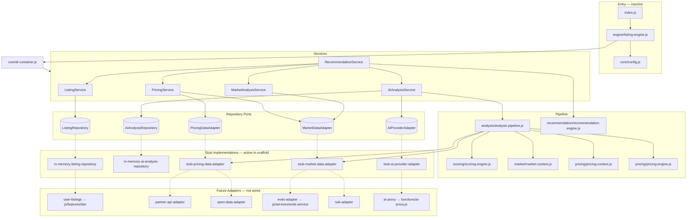

# isteBul AI Listings Engine v1 — Dependency Graph

## Layer Diagram



## Service Dependency Matrix

| Service | Depends On | Produces |
|---------|-----------|----------|
| `ListingService` | `ListingRepository` | CRUD operations |
| `AIAnalysisService` | `AIAnalysisRepository`, `AIProviderAdapter`, `AnalysisPipeline` | `AIAnalysis` |
| `MarketAnalysisService` | `MarketDataAdapter` | `market_score`, `MarketContext` |
| `PricingService` | `PricingDataAdapter`, `MarketDataAdapter` | `price_score`, `PricingContext` |
| `RecommendationService` | All above services | Ranked `ListingRecommendation[]` |

## Adapter Port Contracts

### ListingRepository

```
findById(id) → Listing | null
findMany(query) → Listing[]
save(listing) → Listing
deleteById(id) → boolean
```

### AIAnalysisRepository

```
findByListingId(listingId) → AIAnalysisRecord | null
save(record) → AIAnalysisRecord
deleteByListingId(listingId) → boolean
```

### MarketDataAdapter

```
fetchSnapshot({ category, location, currency }) → MarketSnapshot
getSourceId() → string
```

### PricingDataAdapter

```
fetchBenchmark({ category, location, attributes }) → PricingBenchmark | null
getSourceId() → string
```

### AIProviderAdapter

```
generateAnalysis({ listing, context }) → AIProviderResponse | null
getProviderId() → string
```

## Internal Module Dependencies (no external production imports)

```
core/config.js          → (standalone)
core/constants.js       → (standalone)
core/di-container.js    → services, repository stubs
models/listing.js       → core/constants
models/ai-analysis.js   → core/constants
services/*              → models, core/config, repository interfaces
analysis-pipeline.js    → scoring, market, pricing, stub adapters
engine/listing-engine.js → di-container, core/config
index.js                → re-exports only
```

## Isolation Guarantee

- **No file in `js/` imports from `src/ai-listings/`**
- **No file in `src/ai-listings/` imports from `js/`** (stubs only; TODO markers for future bridges)
- **No route or HTML references the module**
- **No global CSS or database schema changes**
