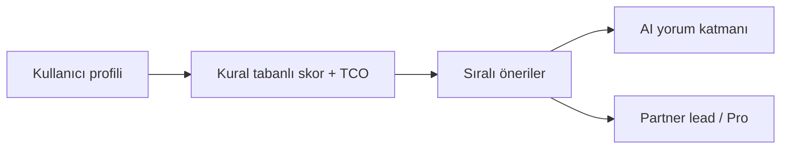

# isteBul — Pitch Deck Outline

**Format:** 12–14 slides · 10–12 dk pitch · TR veya EN  
**Audience:** Seed / pre-seed VC, angels, strategic (OEM, bank, marketplace)  
**Data room:** `docs/investor/DATA_ROOM_INDEX.md` · Live metrics: Admin → Investor KPIs

---

## Slide 1 — Cover

**Headline:** isteBul — AI decision platform for high-consideration purchases

**Sub:** Starting with automotive in Turkey · expanding to housing, credit, insurance, travel

**Visual:** Product screenshot (Auto results + score breakdown)

**Footer:** istebul.com · [Founder name] · [Date]

---

## Slide 2 — Problem

**Hook:** People spend ₺500K–₺3M without a single trusted decision layer.

| Pain | Today |
|------|--------|
| Fragmented tools | Listings ≠ finance ≠ total cost |
| Black-box “AI” | Scores without explainability |
| Sales bias | OEM, bank, dealer push single outcome |
| Time cost | Weeks of tabs, spreadsheets, DMs |

**Quote (optional):** User research snippet or founder story — 1 sentence.

---

## Slide 3 — Solution

**isteBul = decision intelligence + execution**



**3 pillars (bullets):**

1. **Transparent scoring** — factor breakdown, confidence tier (not fake AI %)
2. **Total cost of ownership** — 12-month realistic economics
3. **Neutral execution** — dealer / finance / insurance dispatch

**Demo:** 30 sn Auto wizard → top 3 models → lead CTA

---

## Slide 4 — Product (live today)

| Surface | Status |
|---------|--------|
| **isteBul Auto** (`/auto/`) | Production — catalog, TCO, CRM leads |
| **Karar Asistanı** (arac / ev / tatil) | Production — 3 categories |
| **Pro subscription** | Stripe live |
| **Admin CRM + partner dispatch** | Production |

**Screenshot strip:** Wizard · Results · Methodology · Investor KPIs admin

**Do not claim:** “Live ilan fiyatları everywhere” — use “reference models + partner quotes”

---

## Slide 5 — Why now

- **AI trust crisis** → winners separate narration from numbers (our architecture)
- **Turkey auto TAM** — [Founder inserts: annual new + used transaction volume]
- **Finance margin pressure** → banks/dealers pay for qualified intent
- **Regulatory clarity** → simulation labels, KVKK path documented

---

## Slide 6 — Business model

**Hybrid: SaaS + marketplace**

| Stream | Unit | Status |
|--------|------|--------|
| **isteBul Pro** | ₺299/mo · ₺2,870/yr | Live (Stripe) |
| **Dealer leads** | CPL ₺5,000+ (target) | Modeled in CRM |
| **Finance leads** | CPL ₺2,000+ | Intake + dispatch live |
| **Insurance / reports** | CPL / ₺499+ | Early |

**One formula slide:**

```
Revenue = Pro_MRR + Σ(partner_actual_revenue)
```

**Show:** Latest `investor-metrics-snapshot.json` or Admin KPI screenshot — **not static placeholders**

---

## Slide 7 — Traction

**Replace brackets with live export before each meeting.**

| Metric | Source |
|--------|--------|
| MRR / ARR (Pro) | `investor-kpis.js` / Stripe |
| Active subscriptions | `subscriptions` |
| Leads (30d / all) | `auto_leads` |
| Pipeline estimated vs actual | CRM |
| Funnel: view → lead → checkout | Platform analytics |
| Partner dispatch success % | `partner_dispatch_success` events |

**Chart ideas:**

- Auto funnel drop-off (6 steps)
- MRR trend (weekly, from Stripe)
- Lead volume + win rate

**If pre-revenue:** Show engagement proxies + waitlist + pilot partner names (with permission)

---

## Slide 8 — Moat & defensibility

**Today**

- Proprietary `decision-consultant` scoring + tests
- Vehicle truth layer (catalog, cost profiles, finance offers)
- Partner delivery stack (webhook, retry, circuit breaker, audit log)

**Tomorrow**

- Cross-vertical decision graph (konut + kredi + sigorta)
- Live market data feeds
- Outcome data (“models that closed in X days”)

**Detail:** `docs/investor/MOAT_AND_DEFENSIBILITY.md` · `docs/COMPETITIVE_MOAT_STRATEGY.md` (Sahibinden, Arabam, Hepsiemlak, Booking, fintech, marketplaces)

---

## Slide 9 — Market & expansion

**Phase 1 (now):** Turkey · Automotive decision + leads

**Phase 2:** Konut + tatil production parity (`PLATFORM_EXPANSION_ROADMAP.md`)

**Phase 3:** Kredi + sigorta standalone · elektronik

**Global:** Locale foundation live (tr / en / de / ar) — `GLOBAL_EXPANSION_READINESS.md`

**TAM/SAM/SOM:** [Founder inserts spreadsheet numbers]

| Vertical | SAM logic |
|----------|-----------|
| Auto | Transactions × CPL |
| Housing | Mortgage + brokerage leads |
| Travel | Package commission |

---

## Slide 10 — Go-to-market

| Channel | Role |
|---------|------|
| **SEO / content** | Auto rehber, calculators |
| **Product-led** | Free analysis → Pro upgrade |
| **Partner supply** | Dealers, finance, insurance endpoints |
| **B2B (future)** | White-label for banks/OEM |

**CAC hypothesis:** [Founder: paid vs organic split]

**Sales cycle:** Consumer minutes · Partner weeks (onboarding)

---

## Slide 11 — Competition

| | Classifieds | Bank calc | ChatGPT | **isteBul** |
|--|-------------|-----------|---------|-------------|
| Inventory | ✓ | — | — | Partner-linked |
| Neutral rank | — | — | ~ | ✓ |
| TCO + finance | — | Partial | Generic | ✓ |
| Explainable score | — | — | — | ✓ |
| Lead monetization | Ads | Origination | — | ✓ |

**Positioning line:** “We don’t list cars — we help you decide, then connect execution.”

---

## Slide 12 — Team

| Name | Role | Relevant proof |
|------|------|----------------|
| [Founder] | CEO / product | [Background] |
| [CTO / eng] | Platform | [Shipped: audits, deploy, edge] |
| [GTM / ops] | Partners | [Pipeline] |

**Hiring with round:** [e.g. Head of partnerships, senior full-stack, legal/compliance part-time]

**Advisors (optional):** Automotive / fintech / regulatory

---

## Slide 13 — Financials & ask

**Round:** [e.g. Seed ₺X · $Y]

**Use of funds (typical seed split):**

| % | Area |
|---|------|
| 40% | Engineering (verticals + live data) |
| 30% | GTM + partnerships |
| 20% | Legal, compliance, ops |
| 10% | Buffer |

**18-month milestones:**

1. MRR ₺[X] · [N] paying Pro users
2. [N] signed partner contracts · [Y]% realization rate
3. Konut OR tatil vertical live with leads
4. Live pricing provider for Auto

**Financial model:** Attach spreadsheet — assumptions in `UNIT_ECONOMICS.md`

---

## Slide 14 — Risks & close

**We are honest about:**

- Simulation vs live market data (roadmap)
- Partner revenue = modeled until contracts scale
- Legal pack upgrade in progress

**Risk detail:** `RISK_REGISTER.md`

**Close:**

> isteBul is building the decision layer for every major purchase in Turkey — starting where trust and ticket size are highest: the car.

**Ask:** [Meeting / diligence / intro to strategic]

**Contact:** [email] · istebul.com · Data room: GitHub / Notion link

---

## Appendix slides (optional, leave in deck)

| # | Title | Content |
|---|--------|---------|
| A1 | Architecture | `ARCHITECTURE.md` diagram |
| A2 | AI safety | `AI_DECISION_ENGINE.md` — LLM cannot set price |
| A3 | Security | `LAUNCH_PRODUCTION_AUDIT.md` summary |
| A4 | Unit economics | `UNIT_ECONOMICS.md` |
| A5 | Subprocessors | `SUBPROCESSORS.md` |
| A6 | Product roadmap | `PLATFORM_EXPANSION_ROADMAP.md` phases |
| A7 | Tech stack | Cloudflare Pages · Supabase · Stripe · Groq |

---

## Pre-meeting checklist (founder)

- [ ] Export `npm run metrics:investor` → paste key numbers into slide 7
- [ ] Stripe dashboard screenshot (MRR chart)
- [ ] Replace all `[brackets]` with real names/numbers
- [ ] Remove or update any pre-consolidation branch claims — only `main` shipped features
- [ ] Legal review slide 14 risks with counsel
- [ ] 30 sec demo recorded (Loom) embedded in slide 4
- [ ] PDF export: 16:9, max 12 MB, fonts embedded

---

## EN slide titles (if pitching international)

| TR | EN |
|----|-----|
| Problem | The $50K decision gap |
| Solution | Decision intelligence, not another listing site |
| Traction | Early signals |
| Moat | Trust + data + partners |
| Ask | Seed round |

---

*Template version 1.0 — aligns with repo `main` investor-readiness release.*
